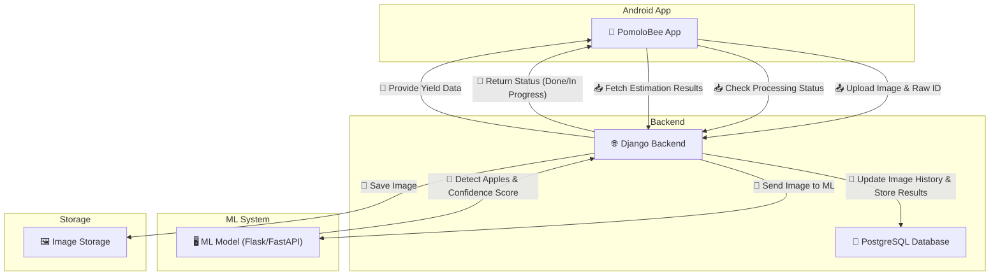

# PomoloBee  
"PomoloBee - Bee Smart Know Your Apple" allows farmers to estimate apple harvest yield.

<p align="center">
    
</p>

 **Total Hours Worked**: _34 hours_ (Auto-generated)  

---

## **Table of Content**  

<!-- TOC -->
- [PomoloBee  ](#pomolobee)
  - [**Table of Content**  ](#table-of-content)
  - [**📚 Documentation**  ](#documentation)
  - [**📌 Project Definition: PomoloBee – Bee Smart, Know Your Apple**  ](#project-definition-pomolobee--bee-smart-know-your-apple)
    - [**🔹 Goal:**  ](#goal)
    - [🌍 **Data Flow in PomoloBee**  ](#data-flow-in-pomolobee)
  - [**📍 Features & Functionalities**  ](#features--functionalities)
    - [**1️⃣ Mobile App (Frontend – Android)**  ](#1-mobile-app-frontend--android)
    - [**2️⃣ Cloud Backend (VPS – Django or Flask API)**  ](#2-cloud-backend-vps--django-or-flask-api)
    - [**📅 Updated Milestones**  ](#updated-milestones)
  - [**Installation**  ](#installation)
    - [install PomoloBeeDjango on the VPS](#install-pomolobeedjango-on-the-vps)
<!-- TOC END -->


---

## **📚 Documentation**  

📖 **Scope and Requirements:** [Requirements](documentation/Requirements.md)  
📖 **API, Interface Definition:** [API](documentation/API.md)  
📖 **Data Model:** [Data Model](documentation/DataModel.md)  
📖 **Workflow:** [Workflow](documentation/Workflow.md)  
📖 **ML Specification:** [MLSpecification](documentation/MLSpecification.md)  

---

## **📌 Project Definition: PomoloBee – Bee Smart, Know Your Apple**  

### **🔹 Goal:**  
Develop an **Android app** (Kotlin + Android Studio) that allows farmers to estimate **apple harvest yield** using AI-based **video or image analysis**. The system will use a **cloud-based backend (VPS)** to process data and provide accurate results.  

---

### 🌍 **Data Flow in PomoloBee**  

The following diagram illustrates the interaction between the **PomoloBee App**, **Django Backend**, and **ML Processing Service**.




---

## **📍 Features & Functionalities**  

### **1️⃣ Mobile App (Frontend – Android)**  
📱 **User Actions:**  
✅ **Record or Upload Video** – User walks through the orchard while capturing video.  
✅ **Take a Picture** – Alternative to video for quick analysis.  
✅ **Mark Orchard Parameters** – Farmer defines start and end of a tree row.  
✅ **Enter Field Data** – Total orchard row length, tree count, sample apple size.  
✅ **Receive Harvest Estimate** – Displays apple count and estimated yield.  
✅ **Local AI Estimation (NEW - Phase 2)** – Farmers can analyze images **offline** using **on-device AI**.  
✅ **Manual Override of AI Results (NEW - Phase 2)** – Farmers can manually adjust apple count & weight.  
✅ **Historical Tracking (NEW - Phase 3)** – Compare past yield estimations.  

🔧 **Tech Stack:**  
- **Language:** Kotlin  
- **Networking:** Retrofit (API calls to VPS)  
- **UI:** Jetpack Compose  
- **Local AI Processing:** OpenCV + TensorFlow Lite (Phase 2)  

---

### **2️⃣ Cloud Backend (VPS – Django or Flask API)**  
🌐 **Server Responsibilities:**  
✅ **Receive video/image uploads from the app**  
✅ **Extract key frames from video**  
✅ **Apple Detection & Counting (AI Model)**  
✅ **Calculate Total Yield Estimate**  
✅ **Return Results to the App**  

---

### **📅 Updated Milestones**  

✅ **Phase 1 – MVP**  
- **Offline image storage & manual upload.**  
- **Basic apple detection model (YOLOv8).**  
- **Simple backend API (Django + PostgreSQL).**  

🚀 **Phase 2 – AI Enhancements & Manual Input**  
- **Apple maturity classification (color-based).**  
- **Local AI model for offline analysis (TensorFlow Lite).**  
- **Manual override of AI results.**  
- **Offline-only mode option in settings.**  

🌍 **Phase 3 – Future Improvements**  
- **Historical tracking & yield comparison.**  
- **Video-based Optical Flow Tracking.**  
- **Export yield estimations (CSV, PDF reports).**  


---

## **Installation**  

clone github :
git clone https://github.com/nathabee/PomoloBee.git
- PomoloBeeApp : code for android studio
- PomoloBeeDjango : code for the backend in the VPS
- PomoloBeeML


### install PomoloBeeDjango on the VPS
- copy the PomoloBeeDjango folder in you seveur
- install database : see **Django PostgreSQL specification** [Django_PostgreSQL](documentation/Django_PostgreSQL.md)  

- **Create a virtual environment and activate**:
   ```bash
   cd PomoloBeeDjango
   python3 -m venv venv 
   source venv/bin/activate
   pip install -r requirements.txt
   ```
- **create a PomoloBeeDjango/.env file containing the correct**

   ```bash
  SECRET_KEY=your-very-secret-key
  DEBUG=True
 
  BYPASS_MEDIA=False
  MEDIA_URL=https://your-cdn.com/media/
  MEDIA_ROOT=/var/www/media/
 

  # Database Configuration
  DATABASE_NAME=pomolobee
  DATABASE_USER=pomolo_user
  DATABASE_PASSWORD=your-secure-db-password
  DATABASE_HOST=localhost
  DATABASE_PORT=5432

   ```

-- in production Use a Web Server for Media Files (Recommended)
If using Apache, add in the conf :
   ```bash
Alias /media/ /path/to/your/media/
<Directory /path/to/your/media/>
    Require all granted
</Directory>

   ```


- **configure Django to be started with Unicorn and add it to the cron tab**:
   ```bash
   cd PomoloBeeDjango 
   .....to be defined
   ```


- **make migration : database table, data population**:

   in PomoloBeeDjango : 

   ```bash
   
  cd  PomoloBee/PomoloBeeDjango 
  source venv/bin/activate 
  python manage.py makemigrations core
  python manage.py migrate
  python manage.py runserver
   ```

- **make migration :  data population(if needed) or populate with the admin console**:

  - **Initialisation with json files**
  adapt the json file containing fake data about fruit, field and raw to your need:
    ```bash
    cd PomoloBeeDjango/core/fixtures
    edit and modify
    ```
    
    ```bash
    cd  PomoloBee/PomoloBeeDjango 
    source venv/bin/activate     
    python manage.py loaddata core/fixtures/initial_fields.json
    python manage.py loaddata core/fixtures/initial_fruits.json
    python manage.py loaddata core/fixtures/initial_raws.json
    ```

  - **Initialisation with the admin console**
  in your webbrowser log with the superuser  pomobee to  http://127.0.0.1:8000/admin/
  add fruits, fields and raws
---