# PomoloBee
"PomoloBee - Bee Smart Know Your Apple" , allows farmers to estimate apple harvest yield

## Documentation 

📚 **Documentation:** [Documentation](documentation/) for more details.  

📖 **Scope and Requirements:** [Requirements](documentation/Requirements.md)
📖 **API , Interface definition:** [API](documentation/API.md) 
📖 **Data Model:** [Data Model](documentation/DataModel.md) 
📖 **Workflow:** [Workflow](documentation/Workflow.md)   
📖 **ML Specification:** [MLSpecification](documentation/MLSpecification.md)   
---

## **📌 Project Definition: PomoloBee – Bee Smart, Know Your Apple**

### **🔹 Goal:**  
Develop an **Android app** (Kotlin + Android Studio) that allows farmers to estimate **apple harvest yield** using AI-based **video or image analysis**. The system will use a **cloud-based backend (VPS)** to process data and provide accurate results.  

### 🌍 Data Flow in PomoloBee

The following diagram illustrates the interaction between the **PomoloBee App**, **Django Backend**, and **ML Processing Service**.

```mermaid
graph TD

  %% Define Components %%
  subgraph Android App
    MobileApp["📱 PomoloBee App"]
  end

  subgraph Backend
    DjangoServer["🌐 Django Backend"]
    Database["📂 PostgreSQL Database"]
  end

  subgraph ML System
    MLService["🖥️ ML Model (Flask/FastAPI)"]
  end

  subgraph Storage
    FileSystem["🖼️ Image Storage"]
  end

  %% Data Flow %%
  MobileApp -- "📤 Upload Image & Raw ID" --> DjangoServer
  DjangoServer -- "📂 Save Image" --> FileSystem
  DjangoServer -- "🔄 Send Image to ML" --> MLService
  MLService -- "🔢 Detect Apples & Confidence Score" --> DjangoServer
  DjangoServer -- "📄 Update Image History & Store Results" --> Database
  MobileApp -- "📥 Check Processing Status" --> DjangoServer
  DjangoServer -- "📄 Return Status (Done/In Progress)" --> MobileApp
  MobileApp -- "📥 Fetch Estimation Results" --> DjangoServer
  DjangoServer -- "📄 Provide Yield Data" --> MobileApp
```

---

## **📍 Features & Functionalities**
### **1️⃣ Mobile App (Frontend – Android)**
📱 **User Actions:**  
✅ **Record or Upload Video** – User walks through the orchard while capturing video.  
✅ **Take a Picture** – Alternative to video for quick analysis.  
✅ **Mark Orchard Parameters** – Farmer defines start and end of a tree row (e.g., with red markers).  
✅ **Enter Field Data** – Total orchard row length, tree count, sample apple size.  
✅ **Receive Harvest Estimate** – Displays apple count and estimated yield.  

🔧 **Tech Stack:**  
- **Language:** Kotlin  
- **Networking:** Retrofit (API calls to VPS)  
- **UI:** Jetpack Compose or XML-based UI  

---

### **2️⃣ Cloud Backend (VPS – Django or Flask API)**
🌐 **Server Responsibilities:**  
✅ **Receive video/image uploads from the app**  
✅ **Extract key frames from video** (1 per second or as needed)  
✅ **Apple Detection & Counting (AI Model)**  
   - Detects apples in images  
   - Differentiates between growth stages (small green vs. ripe apples)  
   - Avoids duplicate counting using **Optical Flow Tracking**  
✅ **Calculate Total Yield Estimate**  
   - Uses detected apples per meter to scale up yield  
✅ **Return Results to the App**  

🔧 **Tech Stack:**  
- **Backend Framework:** Django REST Framework or Flask  
- **ML Processing:** OpenCV, YOLOv8, TensorFlow/PyTorch  
- **Storage:** PostgreSQL (optional for storing farmer data)  
- **Hosting:** VPS with GPU support (if needed for AI acceleration)  

---

### **3️⃣ Machine Learning Model (AI for Apple Detection)**
🤖 **AI Tasks:**  
✅ **Detect Apples** – Identify apples at different growth stages (small, green, ripe).  
✅ **Estimate Maturity** – Classify apple color & size for ripeness assessment.  
✅ **Prevent Duplicate Counting** – Use **Optical Flow Tracking** for movement tracking.  
✅ **Calibrate Accuracy** – Farmer can input **reference apple size** for model correction.  

🔧 **Tech Stack:**  
- **Object Detection Model:** YOLOv8 (best for real-time detection)  
- **Color & Maturity Analysis:** HSV color filtering  
- **Tracking & Counting:** Optical Flow (Lucas-Kanade or Farneback)  

--- 