#  PomoloBee
"PomoloBee - Bee Smart Know Your Apple"  
PomoloBee is an AI-powered tool that helps farmers estimate apple yield using image or video analysis.
This repository contains the mobile app, backend server, and ML microservice for end-to-end deployment.


<p align="center">
    
</p>

 **Total Hours Worked**: _68 hours_ (Auto-generated)  

---

<details>
<summary>Table of Content</summary>

<!-- TOC -->
- [PomoloBee](#pomolobee)
  - [**Documentation**](#documentation)
  - [**Project Definition PomoloBee Bee Smart Know Your Apple**](#project-definition-pomolobee-bee-smart-know-your-apple)
    - [**Goal**](#goal)
    - [**Data Flow in PomoloBee**](#data-flow-in-pomolobee)
  - [**Features Functionalities**](#features-functionalities)
    - [**1 Mobile App Frontend Android**](#1-mobile-app-frontend-android)
    - [**2 Cloud Backend VPS Django or Flask API**](#2-cloud-backend-vps-django-or-flask-api)
    - [**Updated Milestones**](#updated-milestones)
- [**Installation**](#installation)
  - [1. Clone Folder Overview](#1-clone-folder-overview)
  - [2. install PomoloBeeML on the VPS](#2-install-pomolobeeml-on-the-vps)
    - [**Training the Apple Detection Model**](#training-the-apple-detection-model)
  - [3. install PomoloBeeDjango on the VPS](#3-install-pomolobeedjango-on-the-vps)
- [Start Servers](#start-servers)
  - [Start the ML Server PomoloBeeML](#start-the-ml-server-pomolobeeml)
  - [Start the Django Backend PomoloBeeDjango](#start-the-django-backend-pomolobeedjango)
    - [in production](#in-production)
- [FAQ](#faq)
    - [5. ️ Run Your Server](#5-run-your-server)
<!-- TOC END -->
 
</details> 

  
---

## **Documentation**

📖 **Scope and Requirements:** [Requirements](documentation/Requirements.md)  
📖 **API, Interface Definition:** [API](documentation/API.md)  
📖 **Data Model:** [Data Model](documentation/Django_DataModel.md)  
📖 **Workflow:** [Workflow](documentation/Workflow.md)  
📖 **ML Specification:** [ML Specification](documentation/ML_Specification.md)  
📖 **App Specification:** [App Specification](documentation/App_Specification.md)  [App Structure](documentation/App_Structure.md)  
📖 **Database Specification:** [PostgresSQL Specification](documentation/Django_PostgreSQL.md)   

---

## **Project Definition PomoloBee Bee Smart Know Your Apple**

### **Goal**
Develop an **Android app** (Kotlin + Android Studio) that allows farmers to estimate **apple harvest yield** using AI-based **video or image analysis**. The system will use a **cloud-based backend (VPS)** to process data and provide accurate results.  

---

### **Data Flow in PomoloBee**

The following diagram illustrates the interaction between the **PomoloBee App**, **Django Backend**, and **ML Processing Service**.

```mermaid
graph TD
  subgraph Android App
    MobileApp["📱 PomoloBee App"]
  end

  subgraph Backend
    DjangoServer["🌐 Django Backend"]
    Database["📂 PostgreSQL Database"]
  end

  subgraph ML System
    MLService["🖥️ ML Model (Flask/FastAPI)"]
  end

  subgraph Storage
    FileSystem["🖼️ Image Storage"]
  end

  MobileApp -- "📤 Upload Image & Raw ID" --> DjangoServer
  DjangoServer -- "📂 Save Image" --> FileSystem
  DjangoServer -- "🔄 Send Image to ML" --> MLService
  MLService -- "🔢 Detect Apples & Confidence Score" --> DjangoServer
  DjangoServer -- "📄 Update Image History & Store Results" --> Database
  MobileApp -- "📥 Check Processing Status" --> DjangoServer
  DjangoServer -- "📄 Return Status (Done/In Progress)" --> MobileApp
  MobileApp -- "📥 Fetch Estimation Results" --> DjangoServer
  DjangoServer -- "📄 Provide Yield Data" --> MobileApp
```



    
---

## **Features Functionalities**

### **1 Mobile App Frontend Android**
📱 **User Actions:**  
✅ **Record or Upload Video** – User walks through the orchard while capturing video.  
✅ **Take a Picture** – Alternative to video for quick analysis.  
✅ **Mark Orchard Parameters** – Farmer defines start and end of a tree row.  
✅ **Enter Field Data** – Total orchard row length, tree count, sample apple size.  
✅ **Receive Harvest Estimate** – Displays apple count and estimated yield.  
✅ **Local AI Estimation (NEW - Phase 2)** – Farmers can analyze images **offline** using **on-device AI**.  
✅ **Manual Override of AI Results (NEW - Phase 2)** – Farmers can manually adjust apple count & weight.  
✅ **Historical Tracking (NEW - Phase 3)** – Compare past yield estimations.  

🔧 **Tech Stack:**  
- **Language:** Kotlin  
- **Networking:** Retrofit (API calls to VPS)  
- **UI:** Jetpack Compose  
- **Local AI Processing:** OpenCV + TensorFlow Lite (Phase 2)  
 
---

### **2 Cloud Backend VPS Django or Flask API**
🌐 **Server Responsibilities:**  
✅ **Receive video/image uploads from the app**  
✅ **Extract key frames from video**  
✅ **Apple Detection & Counting (AI Model)**  
✅ **Calculate Total Yield Estimate**  
✅ **Return Results to the App**  
 
---

### **Updated Milestones**

✅ **Phase 1 – MVP**  
- **Offline image storage & manual upload.**  
- **Basic apple detection model (YOLOv8).**  
- **Simple backend API (Django + PostgreSQL).**  

🚀 **Phase 2 – AI Enhancements & Manual Input**  
- **Apple maturity classification (color-based).**  
- **Local AI model for offline analysis (TensorFlow Lite).**  
- **Manual override of AI results.**  
- **Offline-only mode option in settings.**  

🌍 **Phase 3 – Future Improvements**  
- **Historical tracking & yield comparison.**  
- **Video-based Optical Flow Tracking.**  
- **Export yield estimations (CSV, PDF reports).**  


---

# **Installation**

## 1. Clone Folder Overview

clone github :
git clone https://github.com/nathabee/PomoloBee.git
- PomoloBeeApp : code for android studio
- PomoloBeeDjango : code for the backend in the VPS
- PomoloBeeML


## 2. install PomoloBeeML on the VPS

- copy the PomoloBeeDjango folder in you server, ML code is in PomoloBeeML


### **Training the Apple Detection Model**

> 📁 The training dataset is **not included** in the GitHub repo for size and licensing reasons.

#### 1. Download Training Data

You can **import a dataset manually** or use a public one:

- [AppleA Dataset](https://github.com/Sayani07/AppleA-dataset)
- [Roboflow - Apple Detection](https://universe.roboflow.com/)
- [Google OpenImages (Apples Class)](https://storage.googleapis.com/openimages/web/index.html)

> Save the dataset in **YOLO format** into this structure:

```bash
PomoloBeeML/data/
├── images/
│   ├── train/
│   └── val/
├── labels/
│   ├── train/
│   └── val/
└── data.yaml       # YOLO training config
```

You can create the folders like this:

```bash
cd PomoloBeeML
mkdir -p data/images/train data/images/val
mkdir -p data/labels/train data/labels/val
touch data/data.yaml
```

---

#### 2. Train the Model

Follow the training instructions [ML Training Notebook](documentation/ML_Training_Notebook.md) to set up YOLOv8 and train your model using the dataset.


It will guide you through:

- Installing Ultralytics YOLOv8
- Training with your dataset
- Saving the trained weights

---

#### 3. Use the Trained Model

After training completes:

- Copy your best model (e.g., `runs/detect/train/weights/best.pt`)
- Save it as:

```bash
PomoloBeeML/model/best.pt
```

The Flask API will automatically use this model for inference.

> 🧪 Test inference via: `POST /ml/process-image` with an image ID and URL.

---


## 3. install PomoloBeeDjango on the VPS
- copy the PomoloBeeDjango folder in you server
- install database : see **Django PostgreSQL specification** [Django_PostgreSQL](documentation/Django_PostgreSQL.md)  

- **Create a virtual environment and activate**:
   ```bash
   cd PomoloBeeDjango
   python3 -m venv venv 
   source venv/bin/activate
   pip install -r requirements.txt
   ```
- **create a PomoloBeeDjango/.env file containing the correct**

   ```bash
  SECRET_KEY=your-very-secret-key
  DEBUG=True
 
  BYPASS_MEDIA=False
  MEDIA_URL=https://your-cdn.com/media/
  MEDIA_ROOT=/var/www/media/
 

  # Database Configuration
  DATABASE_NAME=pomolobee
  DATABASE_USER=pomolo_user
  DATABASE_PASSWORD=your-secure-db-password
  DATABASE_HOST=localhost
  DATABASE_PORT=5432

   ```

-- in production Use a Web Server for Media Files (Recommended)
If using Apache, add in the conf :
   ```bash
Alias /media/ /path/to/your/media/
<Directory /path/to/your/media/>
    Require all granted
</Directory>

   ```


  - **Initialisation with json files**
  adapt the json file containing fake data about fruit, field and raw to your need:
    ```bash
    cd PomoloBeeDjango/core/fixtures
    edit and modify
    ```
    
- **create pomobee superuser and make migrations : database table**:
 
To drop database, recreate, and re-apply fixtures as needed.
Run the script and give the new superuser password as parameter
 
```bash
./scripts/reset_db.sh <superuser_password>
```

  - **InModification with the admin console**
  in your webbrowser log with the superuser  'pomobee' to  http://127.0.0.1:8000/admin/
  add/modify new fruits, fields and raws
---
 
 

# Start Servers

After installation is complete, follow these steps to launch the system.

---

## Start the ML Server PomoloBeeML

📦 Make sure your trained model exists at `model/best.pt`. Otherwise, the ML server will return simulated detections only.


```bash
cd PomoloBeeML
source venv/bin/activate       # Activate the virtual environment
python app.py                  # Start the Flask ML microservice
```

> The ML server will run on `http://localhost:5000`  
> It listens at `POST /ml/process-image` and `GET /ml/version`

---

## Start the Django Backend PomoloBeeDjango

```bash
cd PomoloBeeDjango
source venv/bin/activate       # Activate Django environment
python manage.py runserver     # Start the Django development server
```

> Django will be accessible at `http://127.0.0.1:8000/`  
> API base path: `/api/` — e.g. `POST /api/images/`

### in production
 **configure Django to be started with Unicorn and add it to the cron tab**:
   ```bash
   cd PomoloBeeDjango 
   .....to be defined
   ```
---

# FAQ

**Q: Where is the training dataset?**  
A: It's not included in the repo. Please download it from Roboflow, AppleA dataset, or your own annotated data.

**Q: How do I reset the database?**  
A: Use a script to drop database, recreate, and re-apply fixtures as needed.
replace with your superuser password
 
```bash
./scripts/reset_db.sh <superuser_password>
```

### 5. ️ Run Your Server

```bash
python manage.py runserver
```

---
 
 
 

**Q: What if the ML service doesn't respond?**  
A: Check if Flask is running on `http://localhost:5000`. You can also enable retry from the app via `/api/retry_processing/`.

