**PomoloBee App**
Since **video processing is not in scope right now**, we will focus only on **image-based fruit detection**.


---
# Table of Content
<details>
<summary>Table of Content</summary>
 
<!-- TOC -->
- [Table of Content](#table-of-content)
- [**PomoloBeeApp Workflow**](#pomolobeeapp-workflow)
  - [**Screen Flow Diagram**](#screen-flow-diagram)
  - [**Menu**](#menu)
  - [**Explanation of Flow**](#explanation-of-flow)
- [UI Frame](#ui-frame)
  - [**`CameraScreen`**](#camerascreen)
    - [**Purpose**](#purpose)
    - [**Main UI Elements**](#main-ui-elements)
    - [**Wireframe**](#wireframe)
    - [ALGORITHM FLOW](#algorithm-flow)
  - [**`LocationScreen`**](#locationscreen)
    - [**Purpose**](#purpose)
    - [**Main UI Elements**](#main-ui-elements)
    - [**Updated Wireframe**](#updated-wireframe)
  - [**`SvgMapScreen`**](#svgmapscreen)
    - [**Purpose**](#purpose)
    - [**Main UI Elements**](#main-ui-elements)
    - [**Updated Wireframe**](#updated-wireframe)
  - [**`ProcessingScreen`**](#processingscreen)
    - [**Purpose**](#purpose)
    - [**Two-Part Display**](#two-part-display)
    - [**Updated Wireframe**](#updated-wireframe)
    - [**API Calls**](#api-calls)
    - [**Polling Strategy**](#polling-strategy)
    - [**Triggered API Behavior**](#triggered-api-behavior)
  - [**`ResultScreen`**](#resultscreen)
    - [**Purpose**](#purpose)
    - [**Updated Wireframe**](#updated-wireframe)
  - [**`SettingsScreen`**](#settingsscreen)
    - [**Purpose**](#purpose)
    - [**Test Connection**](#test-connection)
    - [**Wireframe Cloud vs Local**](#wireframe-cloud-vs-local)
    - [UI Behavior Dynamic Logic](#ui-behavior-dynamic-logic)
    - [API Calls](#api-calls)
  - [**`OrchardScreen`**](#orchardscreen)
    - [**Purpose**](#purpose)
    - [**Wireframe**](#wireframe)
  - [**InitScreen**](#initscreen)
    - [Purpose](#purpose)
    - [Flowchart](#flowchart)
    - [Behavior Summary](#behavior-summary)
    - [UI Design](#ui-design)
    - [Initialization Spinner](#initialization-spinner)
  - [Permissions](#permissions)
    - [️ Recomposition Safety](#recomposition-safety)
  - [**ℹ️ `AboutScreen`**](#i-aboutscreen)
    - [**Purpose**](#purpose)
    - [**Wireframe**](#wireframe)
  - [**ℹ️ `ErrorScreen`**](#i-errorscreen)
    - [**Purpose**](#purpose)
    - [**Wireframe Preview**](#wireframe-preview)
    - [**Developer Notes**](#developer-notes)
    - [**How Logging Works**](#how-logging-works)
- [️ App Architecture Storage Navigation Behavior](#app-architecture-storage-navigation-behavior)
  - [️ **Architecture Overview**](#architecture-overview)
  - [️ App File Tree in Android Storage](#app-file-tree-in-android-storage)
    - [initilisation with example files](#initilisation-with-example-files)
  - [On first launch to Copy assets to `/sdcard/PomoloBee/`](#on-first-launch-to-copy-assets-to-sdcardpomolobee)
    - [Recommended structure to copy to](#recommended-structure-to-copy-to)
  - [**Data Storage Strategy**](#data-storage-strategy)
    - [Jetpack DataStore](#jetpack-datastore)
    - [️ **Image Storage**](#image-storage)
    - [**SVG Config File Handling**](#svg-config-file-handling)
  - [Image Sync Behavior](#image-sync-behavior)
  - [Navigation Events Edge Cases](#navigation-events-edge-cases)
    - [Back Button Rules](#back-button-rules)
  - [️ Expected Device Behavior](#expected-device-behavior)
    - [Image Handling Strategy](#image-handling-strategy)
    - [Required Permissions](#required-permissions)
    - [Error Management](#error-management)
  - [Debug Mode Stage 2](#debug-mode-stage-2)
  - [Sample Data Model](#sample-data-model)
  - [Orchard Config Sync Modes](#orchard-config-sync-modes)
    - [Sync Modes](#sync-modes)
    - [Config File Format](#config-file-format)
    - [Config Storage Path](#config-storage-path)
    - [Runtime Behavior](#runtime-behavior)
    - [Sync Button Behavior](#sync-button-behavior)
    - [️ Validation](#validation)
  - [image sync](#image-sync)
  - [**Navigation Events Edge Cases**](#navigation-events-edge-cases)
    - [**Expected Behavior for the Back Button**](#expected-behavior-for-the-back-button)
  - [**Expected Device Behavior**](#expected-device-behavior)
    - [**large images strategie**](#large-images-strategie)
    - [**permissions** needed for camera gallery and storage](#permissions-needed-for-camera-gallery-and-storage)
    - [Error management](#error-management)
  - [Debug Mode Features STADE 2](#debug-mode-features-stade-2)
  - [API Response Handling](#api-response-handling)
  - [What If...?](#what-if)
- [Image management](#image-management)
  - [Image flowchart](#image-flowchart)
<!-- TOC END -->
 
</details>

---

# **PomoloBeeApp Workflow**

## **Screen Flow Diagram**

```mermaid 
graph TD  
  I[🛑 No storage root yet] --> IS[⚙️ InitScreen]
  IS --> A[📷 CameraScreen]
  A -->|User selects image| B[🖼️ Image Preview]
  B -->|Select Field & Row| L[📍 LocationScreen]
  L -->|Select Field| L1[Field Selected]
  L1 -->|Dropdown Row| L2[Row Selected from Dropdown]
  L1 -->|Select from Map| M[🗺️ SvgMapScreen]
  M -->|Tap Row & Confirm| L3[Row Selected from SVG]
  L2 -->|Confirm| B1[✅ Location Confirmed]
  L3 -->|Confirm| B1

  B1 -->|Back to CameraScreen| A
  A -->|Save Image Locally| S[💾 Local Storage]

  S -->|Go to Processing Screen| D[📡 ProcessingScreen]
  D -->|Pending Local Images| U[🖼️ Unsent Images List]
  U -->|Analyze| X[📤 Upload to Backend]
  U -->|Preview| Y[🖥️ Local AI Model]

  D -->|Uploaded Images| E[📊 Processed Results]
  E -->|Open Result| R[📊 ResultScreen]

  A --> G[ℹ️ AboutScreen]
  A --> H1[⚙️ SettingsScreen]
  A --> H2[🌳 OrchardScreen]
  H2 -->|Visualize Field| M
 


```


---

## **Menu**
- **CameraScreen**
- **ProcessingScreen**
- **SettingsScreen**
- **OrchardScreen**
- **AboutScreen**

---

## **Explanation of Flow**
once :  **Users access `SettingsScreen`** to synchronize **fields, rows, and fruits** manually.

1️⃣ **User starts in `CameraScreen`** and captures an image or selects from the gallery.  
2️⃣ User taps **"Select Location"**, which opens `LocationScreen`.

3️⃣ In `LocationScreen`, the user:
- Selects a **field** from a dropdown.
- Then **either**:
  - Selects a **row from a dropdown**, or  
  - Taps **"Select from Image"**, which opens `SvgMapScreen` to pick a row visually.

4️⃣ In `SvgMapScreen`, the field’s SVG layout is shown.  
The user taps on a row and confirms the selection, which returns to `LocationScreen`.  
(Only one row can be selected.)

5️⃣ After selecting both field and row, the user taps **"Confirm & Continue"**, returning to `CameraScreen`.  
The app now shows the selected field and row.

6️⃣ The image is saved **locally**, not uploaded immediately.

7️⃣ User navigates to `ProcessingScreen`, where:
- All **unsent images** are listed, each with:
  - **Analyze** → sends to backend  
  - **Preview** → runs local ML (if available)
- Previously uploaded and processed images appear below with status.

8️⃣ Once an image is processed, the user can open it in `ResultScreen` to see:
- Detected fruit
- Estimated yield
- Confidence score

9️⃣ User can also visit:
- **SettingsScreen** → to sync orchard data, configure paths, or debug  
- **OrchardScreen** → view fields/rows & visualize SVG maps (read-only)
- **AboutScreen** → view version, GitHub, etc.

---

# UI Frame


## **`CameraScreen`**


### **Purpose**
- **Capture or load a picture**
- **Save the image information in the DataStorage**  **Stores last results for offline mode (`Jetpack DataStore`)**
- **Stores the image locally first, then allows users to manually upload it later in `ProcessingScreen`.**

### **Main UI Elements**
| **Element** | **Type** | **Description** |
|------------|---------|----------------|
| **📸 Take Picture Button** | `Button` | Opens camera to take a new picture. |
| **🖼️ Upload from Gallery Button** | `Button` | Opens the gallery to select an existing image. |
| **🖼️ Selected Image Preview** | `Image` | Displays the selected image. |
| **📍 Select Location Button** | `Button` | Opens `LocationScreen` to select a **field & row**. |
| **📌 Selected Field & Row Label** | `Text` | Displays the **selected field & row name**. |
| **💾 Save Image Locally Button** | `Button` | Saves image & metadata in local storage instead of uploading. |
| **📂 Storage Path Display** | `Text` | Shows where images are saved. (Configurable in Settings) |
| **➡ Navigate to ProcessingScreen** | `Navigation` | Moves to `ProcessingScreen` to manage uploads. |

### **Wireframe**
```
+--------------------------------+
|  [📸 Take Picture]  [🖼️ Upload from Gallery] |
|--------------------------------|
|  🖼️ [Selected Image Preview]  |
|--------------------------------|
|  📍 Select Location: [🌱 Field] [🌿 Row] |
|  Status: [❌ No Location Selected] |
|--------------------------------|
|  [💾 Save Image Locally]       |
|  Storage Path: /sdcard/PomoloBee/ |
+--------------------------------+
```

- **Triggered API Calls:**
  - **None**

📌 After saving, image is listed in ProcessingScreen > Unsent Images.
 
### ALGORITHM FLOW

1. **Storage Uri**: Loaded from DataStore via `SettingsViewModel` → used with `DocumentFile` API.

2. **Image Capture**:
   - `cameraImageUri`: created via `FileProvider`.
   - `cameraLauncher.launch(uri)` opens native camera.
   - Result is stored in `selectedImageUri`.

3. **Gallery Picker**:
   - Uses `GetContent()` launcher for `"image/*"`.
   - Uri directly assigned to `selectedImageUri`.

4. **Preview**:
   - If `selectedImageUri` is not null, show preview with `AsyncImage`.

5. **Save Image**:
   - Uses `contentResolver.openInputStream(uri)` to load.
   - Decodes to bitmap.
   - Resizes to `800x600` (💡 ~200kB estimated).
   - Uses `DocumentFile.createFile(...)` to create target SAF uri.
   - Compresses and saves to output stream (`JPEG`, 85% quality).

6. **Toast** on save success or error.

---

## **`LocationScreen`**


### **Purpose**
- Enable to select a location of the picture (row) based on field and fruit description

 
### **Main UI Elements**
| **Element** | **Type** | **Description** |
|------------|---------|----------------|
| **🌱 Field Dropdown** | `Dropdown` | Lists fields are retrieved from storage. | 
| **🌿 Row Dropdown** | `Dropdown` | Lists all rows within the selected field retrieved from storage . |
| **✅ select from map** | `Button` | open a sren that shows the selected field to select a row instead of selecting from cmbobox `SvgMapScreen`. |
| **✅ Confirm Button** | `Button` | Saves selection & navigates back to `CameraScreen`. |

### **Updated Wireframe**
```
+--------------------------------+
|  🌱 Select Field: [Dropdown ▼] |
|  🌿 Select Row:   [Dropdown ▼] [select from map]|
|--------------------------------|
|  [✅ Confirm & Continue]       |
+--------------------------------+
```
🔹 **`select from map Button`**  
- Ensures the user has **selected a field* before opening SvgMapScreen.

🔹 **`Confirm & Continue Button`**  
- Ensures the user has **selected both a field and a row** before proceeding.

 

- **Triggered API Calls:**
**none**

 
    
- All field/row data shown in this screen is retrieved from `OrchardCache`.


---

 

## **`SvgMapScreen`**


### **Purpose**
- Enable to select a location of the (row) by selecting a Row on a SVG field representation (field shown is the one selected before )

 
### **Main UI Elements**
| **Element** | **Type** | **Description** |
|------------|---------|----------------|
| 🖼️ SVG Field View | `Interactive SVG Image` | Displays the selected field's layout. Rows are tappable regions in the SVG. |
| **✅ Confirm Button** | `Button` | Saves selection & navigates back to `CameraScreen`. |

### **Updated Wireframe**
```
+--------------------------------+
+--------------------------------+
|  🖼️ [SVG Field View]           |
|  📍 Selected Row: row_4        |
|--------------------------------|
|  [✅ Confirm & Continue]       |
+--------------------------------+
 
``` 

🔹 **`Confirm & Continue Button`**  
- Ensures the user has **selected a row** before proceeding.

 
🔹 ** `SvgMapScreen` logic**
- When loading the field’s map, it gets the field’s `.svg_map_url` (e.g. `/media/fields/svg/C1_map.svg`)
- You map that to:
  ```kotlin
  File("/sdcard/PomoloBee/media/fields/svg/C1_map.svg")
  ```
- If this file contains an `<image xlink:href="/media/fields/background/C1.jpeg" ... />`, you **do not change the href** — because the app will also look up:
  ```kotlin
  File("/sdcard/PomoloBee/media/fields/background/C1.jpeg")
  ```


- **Triggered API Calls:**
**none**    
- All field/row data shown in this screen is retrieved from `OrchardCache`.

- **logic**
- User taps on a path in the SVG.
- That path has an ID like row_2557 → extract 2557 as rowId.
- Using: the current fieldId (we already know it from location.field.fieldId) and the tapped rowId
    - look up the Row object and its FruitType from the OrchardCache.
    - Then show this info in a Dialog (or bottom sheet, but dialog is easier to start).


---
 
## **`ProcessingScreen`**

### **Purpose**
- Manage the lifecycle of captured images, from local storage to backend processing  
- Display their processing status and results  

---

### **Two-Part Display**

✔ **(1) Local Images (Unsent):**  
- Shows images **waiting for upload**  
- Includes:
  - **📤 Analyze** → Sends to backend  
  - **🔍 Preview** → Runs local ML (offline)

✔ **(2) Uploaded Images (Processed/Pending):**  
- Shows all **images already uploaded** to Django  
- Displays their **processing status** and allows reprocessing

---

### **Updated Wireframe**
```
+--------------------------------+
|  🔄 [Refresh Status]          |
|--------------------------------|
|  🚀 Unsent Images (Local)     |
|  🖼️ Image 1   📌 [Row]  📅 [Date]  🔍 Preview  📤 Analyze |
|  🖼️ Image 2   📌 [Row]  📅 [Date]  🔍 Preview  📤 Analyze |
|--------------------------------|
|  ✅ Uploaded Images (Backend) |
|  🖼️ Image 3   📅 [Date]  ✅ Done |
|  🖼️ Image 4   📅 [Date]  ⏳ Processing |
|  🖼️ Image 5   📅 [Date]  ❌ Error |
+--------------------------------+
```

---

### **API Calls**
| Action | Endpoint |
|--------|----------|
| Upload image | `POST /api/images/` |
| Poll image status | `GET /api/images/{image_id}/details/` |
| Get result (if processed) | `GET /api/images/{image_id}/estimations/` |
| Delete image | `DELETE /api/images/{image_id}/` |
| Retry processing | `POST /api/retry_processing/` |
| Manual refresh | `GET /api/images/` |
| Debug error log (optional) | `GET /api/images/{image_id}/error_log/` |

---

### **Polling Strategy**
- The app checks `GET /api/images/{image_id}/details/` every **60 seconds**
- If `status = "Done"` and `processed = true`, the app calls:  
  → `GET /api/images/{image_id}/estimations/`
- If `status = "Processing"` after **5 retries**, app shows a warning:
  > “Processing is taking too long. You may retry or continue later.”
- After 5 retries:
  - App **stops polling**
  - Django may choose to **automatically retry ML call**
  - User can **manually retry** via UI

---

### **Triggered API Behavior**
| UI Action | Behavior |
|-----------|----------|
| 🔄 Refresh Status | Reloads all image states from backend |
| 📤 Analyze | Uploads image to Django |
| 🔍 Preview | Uses local ML model |
| 🔁 Retry Processing | Triggers Django to re-send image to ML |
| 🗑 Delete Image | Removes image from backend & app |
| ⏳ Processing → ✅ Done | App detects status change via polling and fetches results |

---
 

## **`ResultScreen`**


### **Purpose**
✔ Displays **processed image** with detection markers.  
✔ Shows **fruit count, estimated yield, and confidence score**.  
✔ Allows **reprocessing or sharing results**.  

### **Updated Wireframe**
```
+--------------------------------+
|  🖼️ [Processed Image]         |
|                                |
|  🍏 fruit Detected: 12        |
|  📊 Estimated Yield: 48.0 kg   |
|  🎯 Confidence: 85%  [Bar]     |
|--------------------------------|
|  [🔄 Reprocess]   [📤 Share]    |
+--------------------------------+
```

- ✅ **API Calls:**
  - `GET /api/estimations/{image_id}/` (**View Results**)
  - `GET /api/latest_estimations/` (**Fetch Latest**)
  - `GET /api/history/` (**Fetch History**)
  - `GET /api/history/{history_id}/` (**Fetch Single History Record**)
- **Triggered API Calls:**
  - **📊 View Results** → Fetch yield estimation.
  - **📜 View History** → Fetch previous estimations.
---
 
## **`SettingsScreen`**

### **Purpose**

Users must visit this screen at least once after first app launch to configure essential settings and sync orchard data (fields, rows, fruits).., either from the local configuration files or via the cloud API, depending on the selected mode. Without this step, the app cannot assign location metadata to photos or perform yield estimations.
If config already exists from previous sync, this screen can be skipped on startup.

This screen enables users to:

- **Configure and test** the base API and Media URLs
- **Synchronize essential orchard data**
- **Set the image storage path**
- **View and manage pending uploads**

---

🧠 **Orchard data is required** for using the app — without it, users cannot assign location metadata to images or run yield estimation.

✔ Displays the number of **pending local images**  
✔ All user input is saved using **Jetpack DataStore**
🧠 All state changes (URLs, sync mode, debug toggle) are persisted via Jetpack DataStore and exposed by SettingsViewModel.


---

| **Setting**        | **Description** |
|--------------------|-----------------|
| `DJANGO_API_URL`   | Used for all backend communication (`/api/...`) |
| `DJANGO_MEDIA_URL` | Used for all media access (`/media/...`) |

---

### **Test Connection**

📌 The **Test Connection** button verifies both endpoints:

- Sends a `GET /api/ml/version/` to `DJANGO_API_URL`
- Sends a `HEAD` or `GET` to `{DJANGO_MEDIA_URL}/media/fields/svg/default_map.svg`

✅ **Success:**  
→ Show green check: `"Connection OK"`

❌ **Failure:**  
→ Show error popup:  
- `"Cannot reach Django API"` or  
- `"Cannot reach media endpoint"`  
→ Suggest the user to check the URL values

---

### **Wireframe Cloud vs Local**
 

#### Wireframe Sync Mode = `cloud`
Shown when local config is selected

```
+--------------------------------+
| 🧭 Sync Mode: [CLOUD ⬇ / LOCAL 📁] |
|--------------------------------|
| 🌐 API Endpoint:               |
| [ https://api.example.com ]    |
|--------------------------------|
| 🖼 Media Endpoint:             |
| [ https://media.example.com ]  |
|--------------------------------|
| [🔌 Test Connection] ✅        |
| 🔄 Connection Status: OK       |
|--------------------------------|
| [📥 Sync Now]                  |
| Last Sync: 2025-04-11 12:00    |
|--------------------------------|
| 💾 Save Settings               |
+--------------------------------+
| 🧪 API Version: v1.2.3         |
| 🐞 Debug Mode: [ON/OFF]        |
| 📜 View Error Log              |
+--------------------------------+
```

---

#### Wireframe Sync Mode = `local`
```
+--------------------------------+
| 🧭 Sync Mode: [CLOUD ⬇ / LOCAL 📁] |
|--------------------------------|
| 📂 Config Path:                |
| /sdcard/PomoloBee/config/      |
|--------------------------------|
| [📥 Sync Now]                  |
| Last Sync: 2025-04-11 12:00    |
|--------------------------------|
| 💾 Save Settings               |
+--------------------------------+
| 🧪 API Version: —              |
| 🐞 Debug Mode: [ON/OFF]        |
| 📜 View Error Log              |
+--------------------------------+
```

---

### UI Behavior Dynamic Logic

| If `syncMode == "cloud"` | Then show... |
|--------------------------|--------------|
| API Endpoint input       | ✅ visible    |
| Media Endpoint input     | ✅ visible    |
| 🔌 Test Connection button| ✅ visible    |
| Version from API         | ✅ shown      |

| If `syncMode == "local"` | Then show... |
|--------------------------|--------------|
| API/Media inputs         | ❌ hidden     |
| Test Connection          | ❌ hidden     |
| Version                  | ❌ hidden     |
| Config Path              | ✅ shown      |


---

### API Calls

| Trigger | Endpoint | Purpose |
|--------|----------|---------|
| `🔄 Sync Orchard Data` | `GET /api/locations/` or local | Combined field + row |
|                        | `GET /api/fruits/`  or local  | Fruit types |
| `Sync Mode = Local` | _none_ | Load from local config JSON files |
| `Sync Mode = Cloud` | `GET /api/fruits/`, `GET /api/locations/` | Save JSONs locally |
| `🔌 Test Connection` | `GET /api/ml/version/` | Verifies API endpoint |
|                      | `HEAD /media/fields/svg/default_map.svg` | Verifies media access |
| `🛠 Debug Mode`      | `GET /api/ml/version/` | Show model version |
| `💾 Save`            | _none_ | Locally stores settings in DataStore |


 

---
 


## **`OrchardScreen`**

### **Purpose**
✔ Display all **fields (orchards)** and their respective **tree rows (rows)**  
✔ Allow users to **view structure, orientation, and fruit types**  
✔ Acts as a **read-only orchard overview**, paving the way for future field/row editing  
 

---

### **Wireframe**
```
+----------------------------------------+
| 🌳 Orchard: North Orchard (N)          |
| 📝 Description: Main fruit section     |
| 📝 Visualize button    |
|----------------------------------------|
| 🌿 Row A  • 50 trees • 🍏 Golden fruit  |
| 🌿 Row B  • 40 trees • 🍎 Red fruit     |
|----------------------------------------|
| 🌳 Orchard: South Orchard (S)          |
| 📝 Description: Mixed fruit section    |
| 📝 Visualize button    |
|----------------------------------------|
| 🌿 Row C  • 45 trees • 🍏 Green fruit   |
+----------------------------------------+
```
 
The "Visualize" button allows users to preview the layout of a field. Unlike the `LocationScreen`, row selection is **optional** and no changes are applied.
---

 
---

## **InitScreen**

### Purpose

The `InitScreen` is a one-time or recovery screen that runs when PomoloBee cannot proceed due to missing, inaccessible, or uninitialized storage. It ensures the app:

- Has access to a valid SAF storage folder (chosen by the user)
- Initializes required assets and configuration files
- Rebuilds the image/cache state
- Marks the app as ready (`initDone = true`) to allow access to the main UI

### Flowchart

```mermaid 
flowchart TD
    A[App starts]
    B{InitDone = true?}
    B -- No --> C[Show InitScreen]
    C --> D{Has valid URI?}
    D -- No --> E[Show Welcome UI with folder picker]
    E --> F[User selects SAF folder]
    F --> G[Take URI permission]
    G --> H[Init: copy assets + load config/cache]
    H --> I[markInitDone()]
    I --> Z[Enter main UI]

    D -- Yes --> H
    B -- Yes --> Z


```

---

### Behavior Summary

| # | URI Present | SAF Access | Config Exists | 📱 User Sees | 🛠 Action | 🔁 On Recompose |
|--|-------------|------------|----------------|--------------|-----------|------------------|
| **1️⃣ First install** | ❌ | — | ❌ | Welcome screen + “Select Folder” | User picks folder via SAF | → **Case 4** after user picks folder |
| **2️⃣ Valid setup** | ✅ | ✅ | ✅ | — | InitScreen skipped | ✅ App launches normally |
| **3️⃣ URI set, but no SAF access** | ✅ | ❌ | ✅ |   | Retry access or pick new folder | → **Case 4** after user picks again |
| **4️⃣ URI valid, SAF granted, but no config** (e.g. fresh setup or wiped cache) | ✅ | ✅ | ❌ | Spinner (CircularProgressIndicator) | `initialize()` runs: assets copied, config/image loaded | ✅ If success → mark as done → skip InitScreen next time |
| **5️⃣ Edge case: Config already exists but not marked done** | ✅ | ✅ | ✅ | Spinner | Call markInitDone() silently	 | ✅ Same as case 4 outcome |

---

### UI Design

Because we use the **Storage Access Framework**, we **cannot** prefill or list storage options like “Internal” or “SD card” directly.


```
+------------------------------------------------+
| 🐝 Welcome to PomoloBee                       |
|------------------------------------------------|
| Please choose a folder to store your app data. |
| This is required to continue.                  |
|                                                |
| 📂 A folder is required to proceed.            |
|                                                |
| [ Select Folder ]                              |
+------------------------------------------------+
```

- ✅ Button launches **SAF folder picker**
- ✅ After folder is selected, app checks permission and initializes

---

### Initialization Spinner

Once initialization starts:

```
if (isLoading) {
    Box {
        CircularProgressIndicator()
        Text("Daten werden vorbereitet…")
    }
}
```

- Spinner shown while `initialize()` runs
- When done, `markInitDone()` is called and `onInitFinished()` transitions to app
 


---

## Permissions

SAF automatically handles folder access  
Camera permission requested via:

```kotlin
val cameraPermission = rememberLauncherForActivityResult(
    ActivityResultContracts.RequestPermission()
) { granted -> ... }
```

--- 

### ️ Recomposition Safety

- All UI is driven by `startupStatus` from `SettingsViewModel`
- The Composable only reacts to:
  - `startupStatus`
  - `initDone`
  - `isLoading` (local state)
- `showInitUI` is a derived value (`derivedStateOf`)
- Initialization runs only once per valid status change (`LaunchedEffect(startupStatus)`)
- Picker fallback re-evaluates status after failure

--- 
 
 
## **ℹ️ `AboutScreen`**


### **Purpose**
✔ Displays **app version, usage guide, developer info, and licenses**.  

### **Wireframe**
```
+--------------------------------+
|  ℹ️ How to use the app         |
|  🔗 GitHub repository          |
|  🔢 Version: 1.0.0             |
|  👨‍💻 Developed by Nathabee    |
|  📜 Licenses & References      |
+--------------------------------+
```

---
 Absolutely! Here's a **cleaned-up, structured version** of your `ErrorScreen` documentation — clear, professional, and dev-friendly:

---

## **ℹ️ `ErrorScreen`**

### **Purpose**
✅ Display the list of saved application errors from the file `logs/errors.json`.

To view this screen:  
1. Go to **Settings**  
2. Enable **Debug Mode**  
3. Tap **"📜 View Error Log"**

---

### **Wireframe Preview**
```
+----------------------------------------+
| 🕒 Timestamp                           |
| 📜 Description and Stacktrace         |
+----------------------------------------+
```

---

### **Developer Notes**

- All logs are stored in:  
  **`logs/errors.json`** (located inside the `storageRootUri` directory)
  
- `storageRootUri` is configured during app setup or via the **Settings screen**, and is **persisted using Preferences**.

- In line with **Jetpack Compose architecture**, screens must **never access preferences or cache directly**.

  Instead, the structure follows:

  ```
  Screen ➡ ViewModel ➡ Util / Repository / Preferences / Cache
  ```

- `SettingsViewModel` exposes the `storageRootUri`, and **provides wrapper methods to log errors** from any part of the app.

---

### **How Logging Works**

- Errors are saved through `ErrorLogger.logError(...)`  
- When an error occurs (e.g., in a screen or background operation), call:
  
  ```kotlin
  safeLaunch(context, storageRootUri) {
      // ... your logic here ...
  }
  ```
  or directly:
  ```kotlin
  ErrorLogger.logError(context, storageRootUri, "❌ Something failed", exception)
  ```

- Screens or repositories **should never hardcode `storageRootUri`** or access preferences directly.  
  They must rely on the `SettingsViewModel`.

---
  

# ️ App Architecture Storage Navigation Behavior

## ️ **Architecture Overview**

| Aspect               | Technology                         |
|----------------------|-------------------------------------|
| Language             | Kotlin                              |
| UI                   | Jetpack Compose (no XML)            |
| State Management     | Jetpack ViewModel + DataStore       |
| Theme                | Custom Material3 + Gentium font     |
| Networking           | Retrofit                            |
| Storage              | File I/O + Jetpack DataStore        |
| Media Display        | Glide (for image), Coil (for SVG)   |
| Computer Vision      | OpenCV (local ML inference)         |
| Build System         | KSP (not KAPT)                      |
| Target               | Android 12+ (minSdk 24, target 35)  |

---

## ️ App File Tree in Android Storage

```
/sdcard/PomoloBee/
├── config/
│   ├── fruits.json
│   └── locations.json
├── fields/
│   ├── svg/
│   │   ├── C1_map.svg
│   │   └── default_map.svg
│   └── background/
│       └── C1.jpeg
├── images/
│   ├── pomolobee_001.jpg
│   └── ...
├── logs/
│   └── errors.json
└── results/
    └── image_result_001.json

```

These paths can be selected or changed in `SettingsScreen` via folder picker.

### initilisation with example files

## On first launch to Copy assets to `/sdcard/PomoloBee/`

During initialization, you can check whether files exist in `/sdcard/PomoloBee/...`, and if not, copy from assets.

### Recommended structure to copy to
```plaintext
/sdcard/PomoloBee/
├── config/
│   ├── fruits.json
│   └── locations.json
├── fields/
│   ├── svg/
│   │   ├── C1_map.svg
│   │   └── default_map.svg
│   └── background/
│       └── C1.jpeg
├── images/  
├── logs/ 
└── results/
```

| Step | What to do | Path / Code |
|------|------------|-------------|
| 📁 Package default files | Place in `assets/config/` and `assets/fields/` | `src/main/assets/...` |
| 🧠 On app init | Check if `/sdcard/PomoloBee/` exists | Use `File.exists()` |
| ✨ If missing | Copy from assets → SD card | See `copyAssetsIfNotExists()` above |
| 🔄 Later sync | Cloud sync will replace/update local config files | Use your existing logic |

---

## **Data Storage Strategy**

### Jetpack DataStore

Used for **lightweight persistent key-value storage**:

| Key                    | Type     | Description                             |
|------------------------|----------|-----------------------------------------|
| `sync_mode`            | String   | `"cloud"` or `"local"`                  |
| `last_sync_date`       | Long     | Timestamp                               |
| `nb_fields`            | Int      | Summary count from config               |
| `nb_rows`              | Int      | Summary count from config               |
| `nb_fruit_types`       | Int      | Summary count from config               |
| `DJANGO_API_URL`       | String   | Custom backend endpoint (cloud mode)    |
| `DJANGO_MEDIA_URL`     | String   | Custom media endpoint                   |
| `image_storage_path`   | String   | Path to save photos                     |
| `config_storage_path`  | String   | Path to JSON files                      |
| `debug_mode_enabled`   | Boolean  | Enables mock/dummy/dev tools            |

---

### ️ **Image Storage**

Saved in `/sdcard/PomoloBee/images/`, images are:

- Compressed to max **1080p** resolution
- Stored with unique filename (e.g., `pomolobee_1693080000000.jpg`)
- Indexed via Jetpack DataStore for sync tracking

After saving, they are also added to Android's media gallery via:

```kotlin
val values = ContentValues().apply {
    put(MediaStore.Images.Media.DISPLAY_NAME, "pomolobee_${timestamp}.jpg")
    put(MediaStore.Images.Media.MIME_TYPE, "image/jpeg")
    put(MediaStore.Images.Media.RELATIVE_PATH, "Pictures/PomoloBee")
}
val uri = contentResolver.insert(MediaStore.Images.Media.EXTERNAL_CONTENT_URI, values)
```

---

### **SVG Config File Handling**

- SVGs linked to fields are downloaded (or manually placed) under `/config/svg/`
- Config files (`fields.json`, `locations.json`, `fruits.json`) follow API structure
- All config files are loaded into memory on startup (`OrchardCache`) for fast access

---

## Image Sync Behavior

| Condition | Action |
|----------|--------|
| New image saved | Added to local list, shown in `ProcessingScreen` |
| User taps “Analyze” | Image uploaded to backend |
| Upload fails | Mark as **"Sync Failed"**, allow manual retry |
| User deletes an image | If uploaded, delete via API too |
| Sync only happens manually | No background or automatic sync |

---

## Navigation Events Edge Cases

### Back Button Rules
- From `LocationScreen` → go back to `CameraScreen` and restore previous field/row
- From `ProcessingScreen` with unsent images → show confirmation:  
  “⚠️ You have unsent images. Exit anyway?”
- From `CameraScreen` without image saved → allow navigation freely

---

## ️ Expected Device Behavior

### Image Handling Strategy

| Strategy              | Value           |
|-----------------------|-----------------|
| Max Resolution        | 1920x1080 (1080p) |
| Compression Format    | JPEG            |
| Compression Quality   | ~80–90%         |

### Required Permissions
```xml
<uses-permission android:name="android.permission.CAMERA"/>
<uses-permission android:name="android.permission.READ_EXTERNAL_STORAGE"/>
<uses-permission android:name="android.permission.WRITE_EXTERNAL_STORAGE"/>

But starting Android 10+ (API 29), you should also declare:
 
<application
    android:requestLegacyExternalStorage="true" ... >

```
---

### Error Management

- All API, file, and UI exceptions logged to `/logs/errors.json`
- Show toast/snackbar or popup with details
- Retry logic:
  - 3 attempts
  - Exponential backoff: 1s → 3s → 7s
  - On final failure, mark sync as failed

#### ️ Low Storage Check

Before saving image:

```kotlin
val stat = StatFs(Environment.getExternalStorageDirectory().path)
val bytesAvailable = stat.availableBytes
if (bytesAvailable < 50 * 1024 * 1024) {
    showStorageFullPopup()
}
```

If storage is low, show a popup with:
1. Free up space
2. Change storage location
3. Continue anyway (not recommended)

---

## Debug Mode Stage 2

| Feature                       | Description |
|-------------------------------|-------------|
| Disable Backend Calls         | Run app entirely offline |
| Use Local AI Model            | Bypass cloud ML |
| Manually Enter ML Results     | Developer input for test |
| View API Response Log         | Show last 10 network responses |

---

## Sample Data Model

```json
{
  "pending_images": [
    {
      "id": 1,
      "image_path": "/sdcard/PomoloBee/images/C1_R3_20220412101010.jpg",
      "row_id": 3,
      "date": "2024-03-15"
    }
  ]
}


data class PendingImage(
    val fileName: String,              // e.g., C1_R1_1713190000000.jpg
    val uri: Uri,                      // Optional: full SAF uri for rendering
    val fieldId: Int,
    val rowId: Int,
    val imageId: String?,              // Set after upload
    val date: String,
    val isSynced: Boolean = false,
    val failedSync: Boolean = false
)


```

This reflects the indexed list of unsynced images. Results and metadata will be mirrored in `/results/` once processed.

---   
 

## Orchard Config Sync Modes

This section consolidates all repeated explanations regarding orchard configuration, offline storage, and sync behavior. All other references should simply link to this section (e.g., “See *Orchard Config & Sync Modes*”).

---

### Sync Modes

| Mode     | Description |
|----------|-------------|
| **Cloud** | Data is retrieved from the backend (`/api/fields`, `/api/locations`, `/api/fruits`) and saved as local JSON files. |
| **Local** | Data is loaded from existing JSON config files located on the device (e.g., `/sdcard/PomoloBee/config/`). |

Users select the sync mode in the **Settings screen**. Both modes generate or rely on the same local files, ensuring consistent internal logic.

---

### Config File Format

Regardless of mode, the app uses the same local files (JSON) to cache orchard structure:

| File              | Description                       |
|-------------------|-----------------------------------| 
| `locations.json`  | Combined field + row structure    |
| `fruits.json`     | List of available fruit types     |

These files follow the exact same format as responses from the Django API.

---

### Config Storage Path

All config files (local or downloaded) are stored in config, the svg that is repreenting the mal of the fields is stored in svg/fields and its associated background image if need is stored in media/svg/backgrounds.
New Image of the rows will be stored in media images after being resized

```
/sdcard/PomoloBee/
├── config/                      # all JSON config data
│   ├── fruits.json
│   ├── locations.json
│   └── version.json             # optional - from `/api/ml/version/`
├── media/                       # mimic Django’s media URLs
│   ├── svg/
│   │   ├── fields/
│   │   │   ├── C1_map.svg
│   │   │   └── default_map.svg
│   │   └── backgrounds/
│   │       ├── C1.jpeg
│   │       └── ...
│   └── images/                  # user-captured photos
│       ├── pomolobee_001.jpg
│       └── ...
├── logs/
│   └── errors.json
└── results/
    └── image_result_001.json

```

This path is selectable by the user in `SettingsScreen`. It should remain consistent across both sync modes.

---
### Runtime Behavior

- On app startup, the app **loads the three config files** (`fields.json`, `locations.json`, `fruits.json`) into memory.
- These are parsed into structured models and stored in a singleton memory-only object: `OrchardCache` (see below).
- This in-memory cache enables **fast offline access** without repeated disk reads.
- If files are **missing or unreadable**, the app prompts the user to **sync from the cloud** or **provide local config files** (based on sync mode).
- If sync mode is **cloud but no internet**, the app **falls back to the last saved local config** (if available).
- 🔁 **The cache is reloaded on every cold start. It is _not_ stored in Jetpack DataStore.**

#### `OrchardCache` Runtime-Only

```kotlin
object OrchardCache {
    var fields: List<Field> = emptyList()
    var fruits: List<FruitType> = emptyList()
    var locations: List<FieldWithRows> = emptyList()
}
```

Used by `LocationScreen`, `OrchardScreen`, `SvgMapScreen`, and any logic needing fast access to field/row/fruit data.

---

### Sync Button Behavior

| Mode    | Action triggered by `Sync Now` |
|---------|--------------------------------|
| **Cloud** | Fetches API data → writes to config directory |
| **Local** | Prompts user to copy config files into the directory manually |

---

### ️ Validation

After syncing (in either mode), the app:
- Counts number of fields, rows, and fruit types.
- Updates display in the `SettingsScreen` accordingly.
- Saves summary data to Jetpack `DataStore`.
 ---

## image sync
- the app attempt to sync unsent images Manually only  

- If a user deletes an image :
if the image was not sent yet : no problem
if the image was sent, the delete image is forcing also delete in backend

- If an image **fails to upload** due to network issues:  
  - **Display an error popup.**  
  - Keep the image in the **pending list** and mark it as **"Sync Failed"**.  
  - Allow **manual retry** via a “Retry Sync” button.

---

## **Navigation Events Edge Cases**

  

### **Expected Behavior for the Back Button**
- If the user **hasn’t saved an image yet**, :  the back button is not cancelling the selection  
- If the user **has pending unsent images**, there should be a **warning message** in the topbar
- If the user **started but didn’t finish location selection**, pressing **Back** should:  
  - Return to **CameraScreen** with the **last confirmed field & row**.  
  - **Show a toast message:** _"Location selection canceled. Using previous location."_  

-
---

## **Expected Device Behavior**
- (Performance, Storage, Permissions, Error management)

### **large images strategie**
- Limit image resolution to **1080p** before saving.  
- Define **image compression format (JPEG, PNG, etc.)**.
 
 
### **permissions** needed for camera gallery and storage

 
📌 **Required Android Permissions:**  
```xml
<uses-permission android:name="android.permission.CAMERA"/>
<uses-permission android:name="android.permission.READ_EXTERNAL_STORAGE"/>
<uses-permission android:name="android.permission.WRITE_EXTERNAL_STORAGE"/>
```

### Error management
- The app **warn the user if storage is full**
- Error encounter are always show in pop up
 
#### Error Logging Recovery
- **All errors must be logged in `Jetpack DataStore`** under `/logs/errors.json`

- **If an API call fails** (e.g., `POST /api/images/`), retry **3 times** with exponential backoff.
 

- **Before saving an image**, check if the storage is near **90% full**:
```kotlin
val stat = StatFs(Environment.getExternalStorageDirectory().path)
val bytesAvailable = stat.availableBytes
if (bytesAvailable < 50 * 1024 * 1024) { // Less than 50MB left
   showStorageFullPopup()
}
```
- If storage is **critically low**, show **a pop-up with 3 actions**:
  1. **Free up space**
  2. **Change storage location** (external SD card)
  3. **Ignore & continue (not recommended)**


---
## Debug Mode Features STADE 2
- ✅ **Enable/Disable Backend Calls** → Prevents all API calls.
- ✅ **Use Local AI Model** → Bypasses backend ML model.
- ✅ **Manually Enter Results** → User can input fake ML detection results for testing.
- ✅ **Log API Responses** → Displays the last 10 API responses in a debug console.


## API Response Handling
| **API Call**                 | **Success**  | **Error**  | **UI Behavior** |
|------------------------------|-------------|------------|-----------------|
| `GET /api/images/{id}/status` | `"done"` → Show results | `"processing"` → Show loading icon | ✅ Display status |
| `POST /api/images/`          | `"201 Created"` → Add to uploaded list | `"400 Bad Request"` → Show popup | ✅ Retry if needed |


---

## What If...?
- **What if the user selects a location but never saves the image?**  
  → The image remains in **temporary memory** but will not be added to the unsent list.  

- **What if the storage path becomes unavailable?**  
  → The app should **prompt the user to reselect a storage location** before saving.  

- **What if the backend API response format changes?**  
  → The app should **handle JSON parsing errors gracefully and retry if necessary**.  

# Image management

## Image flowchart


```mermaid 
  
flowchart TD
    A[CameraScreen] --> B[SharedViewModel (temp selected image)]
    B --> C[LocationScreen]
    C -->|Confirm row/field| D[Save image locally]
    D -->|Compress + rename| E[ImageRepository.save()]
    E -->|Add to DataStore| F[ImageListViewModel.unsentImages]
    F --> G[ProcessingScreen]
    G -->|User triggers| H[ImageRepository.upload()]
    H --> I[ImageApiService.upload()]
    I --> J[Save image_id in local metadata]
    J --> K[Poll status]
```