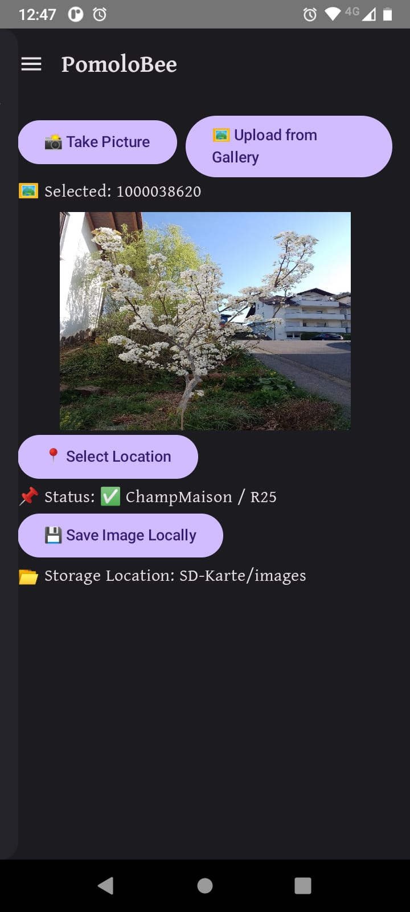
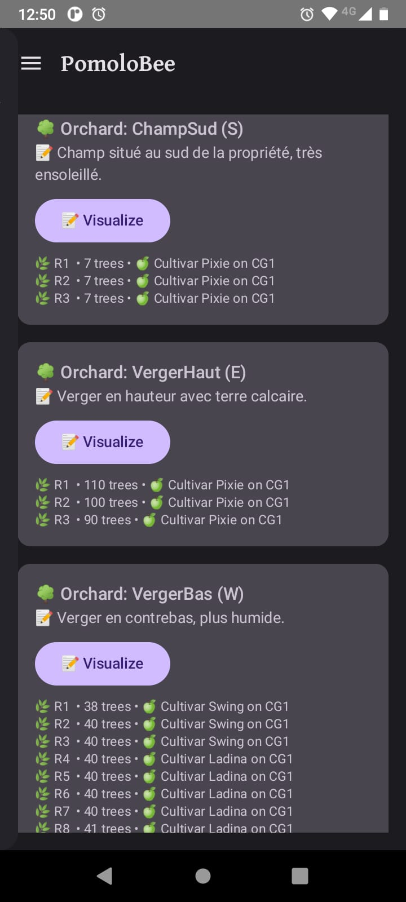
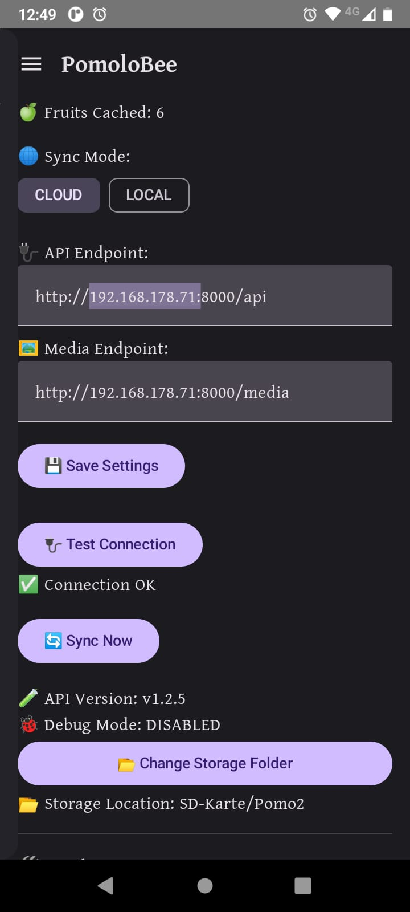
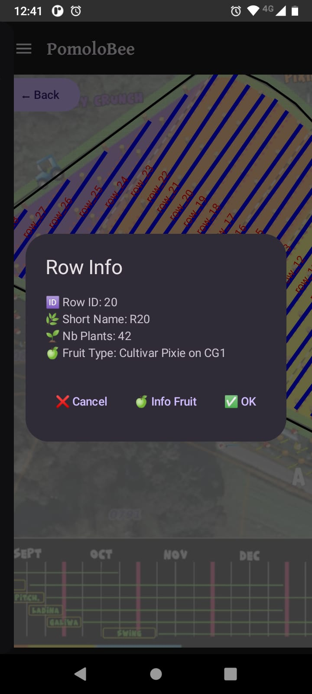
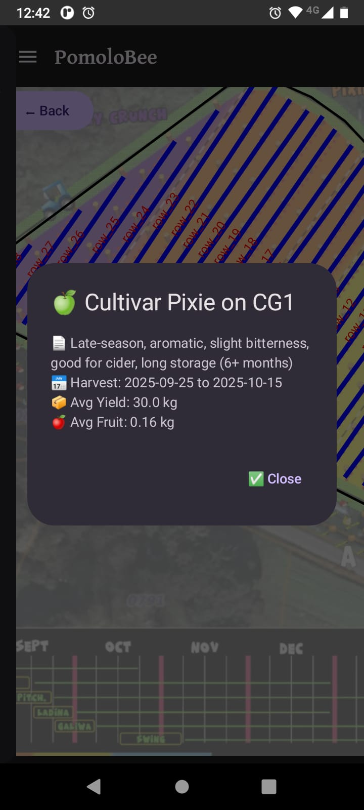

# **APP User docs**
## **Overview**
This is the user manual of the Android App
---

Table of Content

<!-- TOC --> 

---

---

---

## App Screens Overview

### CameraScreen
CameraScreen — used to capture images or load from gallery. This is the main entry point for data acquisition. Users can either take a new photo using the camera or choose one from their gallery. After capturing or selecting an image, users must assign a location (field and row) before saving. Images are stored locally and queued for later analysis in the ProcessingScreen.

  

### OrchardScreen
OrchardScreen — view all fields and tree rows. This screen presents a structured overview of the orchards, showing each field along with its rows and associated fruit types. It serves as a read-only map to help users understand the physical layout of their orchard and is useful for quick verification before assigning a location to an image.

  

### SettingsScreen
SettingsScreen — sync orchard data and configure storage/API. This screen must be used on first launch to set up the storage location, choose between local or cloud mode, and pull orchard configurations. Users can also test API connections, enable debug mode, and manually trigger sync operations. All settings are persisted via Jetpack DataStore.

  

### SvgMapScreen
SvgMapScreen — select a row visually on an SVG field map. Instead of using dropdowns, users can pick a row directly from the orchard's visual layout. This is especially useful for large fields where spatial orientation helps to avoid errors. The screen loads the corresponding field’s SVG and allows tapping on any row to confirm it as the selected one.

#### SvgMapScreen Row Info
SvgMapScreen (Row Info) — tap a row to view row details and fruit type. After selecting a row on the map, the app displays contextual information like row ID and the fruit type grown in that row. This feedback helps users ensure they selected the correct area and builds confidence in the visual selection flow.

  

#### SvgMapScreen Fruit Info

  

---
