# **PomoloBee Workflow Document**

Table of Content

<!-- TOC -->
- [**PomoloBee Workflow Document**](#pomolobee-workflow-document)
  - [**Data Flow**](#data-flow)
  - [**1. Workflow Summary**](#1-workflow-summary)
    - [App Synchronization Initial or Periodic](#app-synchronization-initial-or-periodic)
    - [Upload + Estimation Flow](#upload-estimation-flow)
    - [Displaying or Using the Data](#displaying-or-using-the-data)
  - [**1. API DJANGO to APP**](#1-api-django-to-app)
    - [Image Upload Result](#image-upload-result)
    - [Estimations](#estimations)
    - [Orchard Data](#orchard-data)
  - [**2. API DJANGO both ML**](#2-api-django-both-ml)
  - [**3. Process Image Flow**](#3-process-image-flow)
  - [**2. Detailed Requirements**](#2-detailed-requirements)
    - [App Requirements](#app-requirements)
    - [ML Model Requirements](#ml-model-requirements)
    - [Django Requirements](#django-requirements)
  - [**3. Explanation of Calculation**](#3-explanation-of-calculation)
  - [API Short List](#api-short-list)
  - [**2. Detailed Requirements**](#2-detailed-requirements)
    - [**App Requirements**](#app-requirements)
    - [**ML Model Requirements**](#ml-model-requirements)
    - [**Django Backend Requirements**](#django-backend-requirements)
  - [**3. Explanation of Calculation**](#3-explanation-of-calculation)
    - [**How Yield is Estimated**](#how-yield-is-estimated)
<!-- TOC END -->

---

## **Data Flow**

```mermaid
graph TD 
  subgraph App
    MobileApp["📱 PomoloBee App"]
  end

  subgraph Backend
    DjangoServer["🌐 Django Backend"]
    Database["📂 PostgreSQL Database"]
  end

  subgraph ML System
    MLService["🖥️ ML Model (Flask/FastAPI)"]
  end

  subgraph Storage
    FileSystem["🖼️ Image Storage"]
  end
 
  MobileApp -- "📍 Fetch Available Fields & Rows" --> DjangoServer
  DjangoServer -- "📄 Provide Field & Row Data" --> MobileApp
 
  MobileApp -- "📤 Upload Image & Row ID" --> DjangoServer
  DjangoServer -- "📂 Save Image Metadata" --> Database
  DjangoServer -- "🖼️ Store Image" --> FileSystem
 
  DjangoServer -- "🔄 POST Image to ML" --> MLService
  MLService -- "✅ 200 OK" --> DjangoServer
  MLService -- "📊 POST Results" --> DjangoServer
  DjangoServer -- "📄 Update Estimation" --> Database

  MobileApp -- "📥 GET Image Metadata & Status" --> DjangoServer
  MobileApp -- "📥 GET Image Estimation" --> DjangoServer
  MobileApp -- "📥 GET Estimation History" --> DjangoServer
```

---

## **1. Workflow Summary**

### App Synchronization Initial or Periodic

| Purpose | Endpoint |
|--------|----------|
| Sync all fruit types | `GET /api/fruits/` |
| Sync fields and their rows | `GET /api/locations/` |
| Sync ML version for compatibility | `GET /api/ml/version/` |
| Sync all images | `GET /api/images/list/` |
| Sync all estimations per field | `GET /api/fields/{field_id}/estimations/` |

---

### Upload + Estimation Flow

#### A. **ML-Based Estimation**

1. **Upload Image**
   - `POST /api/images/`
   - Creates an image with optional `xy_location`
   - Triggers ML processing automatically

2. **Django Sends Image to ML**
   - `POST /ml/process-image/`

3. **ML Responds with Results**
   - `POST /api/images/{image_id}/ml_result/`
   - Contains: `fruit_plant`, `confidence_score`, `processed`

4. **Django Stores Estimation**
   - Computes: `plant_kg = fruit_plant * fruit_avg_kg`
   - Then: `row_kg = plant_kg * nb_plant`

5. **App Polls for Result**
   - `GET /api/images/{image_id}/details`
   - or `GET /api/images/{image_id}/estimations/`

#### Retry ML
- If `status = failed`
- `POST /api/retry_processing/`

---

#### B. **Manual Estimation App User Counts Fruits**

1. **Send Estimation + Optional Image**
   - `POST /api/manual_estimation/`
   - Required: `row_id`, `date`, `fruit_plant`
   - Optional: `confidence_score`, `maturation_grade`, `xy_location`, image

2. **Django Creates Image** (status = manual)
   - Image is created even without file (placeholder used)
   - `xy_location` is saved in the Image model

3. **Estimation Stored** with:
   - `source = USER`
   - `fruit_plant = manual count` (used as-is for calculations)

---

### Displaying or Using the Data

| Goal | Endpoint |
|------|----------|
| Poll image processing | `GET /api/images/{image_id}/details` |
| Get final estimation (ML or Manual) | `GET /api/images/{image_id}/estimations/` |
| View field estimation history | `GET /api/fields/{field_id}/estimations/` |
| List images | `GET /api/images/list/?row_id=...&date=...` |

--- 

---

## **1. API DJANGO to APP**

### Image Upload Result
| Method | Endpoint | Description |
|--------|----------|-------------|
| `POST` | `/api/images/` | Upload new image |
| `GET` | `/api/images/{image_id}` | Get image metadata and status |
| `POST` | `/api/retry_processing/` | retry processing images |
| `DELETE` | `/api/images/{image_id}/` | delete a picture from storage
| `POST` | `/api/manual_estimation/` | Upload new image with manual count to trigger a manual estimation |

### Estimations
| Method | Endpoint | Description |
|--------|----------|-------------|
| `GET` | `/api/images/{image_id}/estimations/` | Get estimation for one image ✅ |
| `GET` | `/api/fields/{field_id}/estimations/` | Get all estimations for a field ✅ |

### Orchard Data
| Method | Endpoint | Description |
|--------|----------|-------------|
| `GET` | `/api/fruits/` | List all fruits |
| `GET` | `/api/locations/` | All fields with row rows |

---

## **2. API DJANGO both ML**

| Method | Endpoint | Description |
|--------|----------|-------------|
| `POST` | `/process-image/` | Django sends image to ML |
| `POST` | `/api/images/{image_id}/ml_result/` | ML sends back results ✅ |

---

## **3. Process Image Flow**
1. `POST /api/images/` ← From App  
2. `POST /process-image/` ← Django → ML  
3. `POST /api/images/{image_id}/ml_result/` ← ML → Django  
4. `GET /api/images/{image_id}` ← App polling  
5. `GET /api/images/{image_id}/estimations/` ← App gets results

---

## **2. Detailed Requirements**

### App Requirements
- Store image locally
- Upload image and row_id
- Poll and fetch estimation

### ML Model Requirements
- Accept image + ID
- Return `fruit_plant`, `confidence_score`

### Django Requirements
- Store and track image
- Compute `plant_kg` and `row_kg`
- Serve estimation & orchard data

---

## **3. Explanation of Calculation**

- `fruit_plant = nb_fruit`
- `plant_kg = fruit_plant * fruit_avg_kg`
- `row_kg = plant_kg * row.nb_plant`

---

## API Short List

| Type | Endpoint | Purpose |
|------|----------|---------|
| `GET` | `/api/fruits/` | All fruits |
| `GET` | `/api/locations/` | Fields + rows |
| `GET` | `/api/fields/{field_id}/estimations/` | Estimations for a field ✅ |
| `GET` | `/api/images/{image_id}/details` | Image metadata/status ✅ |
| `DELETE` | `/api/images/{image_id}` | Delete Image from storage |
| `POST` | `/api/images/` | Upload new image (optionally location,user_fruit_plant) and trigger ML |
| `POST` | `/api/retry_processing/` | Retry ML |
| `POST` | `/api/manual_estimation/` | Create an image to store (optionally location,picture) trigger estimation based on  user_fruit_plant  |
| `GET` | `/api/images/{image_id}/estimations/` | Estimation from one image ✅ |
| `POST` | `/api/images/{image_id}/ml_result/` | ML sends results ✅ |
| `GET` | `/api/ml/version/` | Get ML version |

---

## **2. Detailed Requirements**

### **App Requirements**
✅ Store static data locally for offline mode.  
✅ Send an image and row_id to Django for estimation.  

✅ Fetch results for past estimations.  
✅ Sync with Django when online.  

### **ML Model Requirements**
✅ Process an image and return `nb_fruit` (number of fruit detected).  
✅ Return results quickly to avoid app delays.  
✅ Be integrated with Django, either running inside Django or as an external service.  

### **Django Backend Requirements**
✅ Store the image on the server file system.  
✅ Create `Image` with image path + ML results.  
✅ Calculate `plant_kg` and `row_kg` before saving to `Estimation`.  
✅ Provide API endpoints for the app to fetch data. 
✅ Store the image **on the local file system or a cloud storage solution (e.g., AWS S3, Google Cloud Storage)**.  

---

## **3. Explanation of Calculation**

### **How Yield is Estimated**
1. **ML Model detects fruit in the image**  
   - Frontend sends `image + row ID + date` to Django.  
   - Django stores the image path in `Image`.  
   - ML analyzes the image and returns `nb_fruit` (number of fruit detected).  

2. **Django calculates expected yield**  
   - **`fruit_plant = nb_fruit`** (ML-detected fruit per plant or manual count).  
   - **`plant_kg = fruit_plant * fruit_avg_kg`** (expected weight per plant).  
   - **`row_kg = plant_kg * row.nb_plant`** (expected total weight for the row).  

---
  