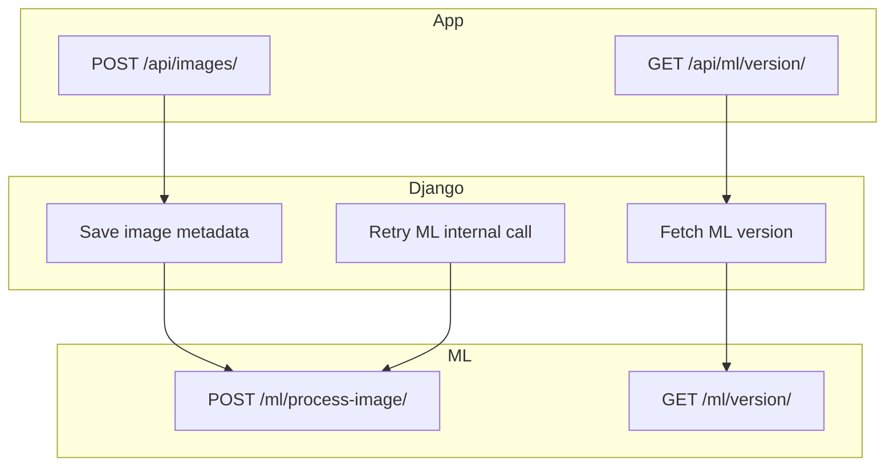

# **API Interface Definition**
## **Overview**
This document defines the API interface for the PomoloBee project, specifying:
- API calls and data exchanged  
- Endpoints and request/response format  
---

<details>
<summary>Table of Content</summary>

<!-- TOC -->
- [**API Interface Definition**](#api-interface-definition)
  - [**Overview**](#overview)
  - [Global API Endpoint Overview](#global-api-endpoint-overview)
    - [1 App to Django](#1-app-to-django)
    - [2 Django to ML](#2-django-to-ml)
    - [3 ML to Django](#3-ml-to-django)
    - [**Trigger Map Simplified Flow**](#trigger-map-simplified-flow)
  - [Document reference](#document-reference)
  - [**JSON Format Conventions**](#json-format-conventions)
    - [Response Structure Success](#response-structure-success)
    - [Response Structure Error](#response-structure-error)
    - [️ Standard Error Codes](#standard-error-codes)
<!-- TOC END -->

</details>

---

## Global API Endpoint Overview

### 1 App to Django

| **Category** | **Endpoints** | **Purpose** | **Caller → Receiver** | **Screen Used In** |
|-------------|---------------|-------------|------------------------|---------------------|
| **Fetching Orchard Data** | `GET /api/fields/` | Fetch all available fields | App → Django | SettingsScreen (🔄 Sync) |
|  | `GET /api/fruits/` | Fetch all fruit types | App → Django | SettingsScreen |
|  | `GET /api/locations/` | Fetch fields + tree rows (rows) for offline storage | App → Django | SettingsScreen |
| **Image Upload & Polling** | `POST /api/images/` | Upload image + metadata (`row_id`, `date`) | App → Django | ProcessingScreen (📤 Analyze) |
|  | `GET /api/images/{image_id}/details` | Retrieve image metadata + processing status | App → Django | ProcessingScreen (polling) |
|  | `POST /api/retry_processing/` | Retry ML if previous attempt failed | App → Django | ProcessingScreen (🔁 Retry) |
|  | `DELETE /api/images/{image_id}` | Remove an image from storage | App → Django | ProcessingScreen (delete) |
| **Estimation Results** | `GET /api/images/{image_id}/estimations/` | Fetch estimation based on a specific image | App → Django | ResultScreen |
|  | `GET /api/fields/{field_id}/estimations/` | Fetch all estimations for a given field | App → Django | ResultScreen |
| **ML Version Check** | `GET /api/ml/version/` | Display ML model version used by backend | App → Django | SettingsScreen |

---

### 2 Django to ML

| **Category** | **Endpoint** | **Purpose** | **Caller → Receiver** |
|--------------|--------------|-------------|------------------------|
| **Send Image for Processing** | `POST /ml/process-image/` | Django sends image to ML model for fruit detection | Django → ML |
| **ML Version Query** | `GET /ml/version/` | Django backend fetches version info from ML | Django → ML |

---

### 3 ML to Django

| **Category** | **Endpoint** | **Purpose** | **Caller → Receiver** |
|--------------|--------------|-------------|------------------------|
| **Submit ML Results** | `POST /api/images/{image_id}/ml_result` | ML sends back detection results (`nb_fruit`, `confidence_score`) | ML → Django |

---

### **Trigger Map Simplified Flow**



---

## Document reference


-  📖 1 **App to Django** [App to Django specification](API_1_App_to_Django.md)
-  📖 2 **Django to ML** [Django to ML specification](API_2_Django_to_ML.md)
-  📖 3 **ML to Django** [ML to Django specification](API_3_ML_to_Django.md)
 
 

---


## **JSON Format Conventions**


To ensure clarity, consistency, and compatibility across the **PomoloBee ecosystem**, all JSON payloads exchanged between the **App** and the **Django backend** must follow the conventions below.


| Rule | Convention |
|------|------------|
| Encoding | UTF-8 |
| Key Naming | `snake_case` |
| Identifiers | `image_id`, `field_id`, `row_id` |
| Booleans | `true` / `false` |
| Dates | ISO 8601: `YYYY-MM-DD` |
| Timestamps | ISO 8601: `YYYY-MM-DDTHH:MM:SS` |
| Reserved Keys | Avoid `id`, `type`, `object`, `meta`, `links` unless defined |


**Never expose row `id` fields** — always use explicit identifiers like `image_id`.
---

### Response Structure Success

```json
{
  "status": "success",
  "data": {
    "image_id": 24,
    "status": "done"
  }
}
```

---

### Response Structure Error

```json
{
  "error": {
    "code": "NO_ESTIMATION_FOUND",
    "message": "Estimation not available yet for this image."
  }
}
```

---

### ️ Standard Error Codes

in Django customize error  will be done with DRF to stay compatible with SWAGGER .


| Code | Meaning |
|------|---------|
| `404_NOT_FOUND` | Missing resource (image, estimation) |
| `409_CONFLICT` | Already processed |
| `ML_UNAVAILABLE` | ML service unreachable |
| `ML_PROCESSING_FAILED` | ML returned an error |
| `NO_ESTIMATION_FOUND` | No results yet |
| `ALREADY_PROCESSED` | Retry not allowed |
| `MISSING_PARAMETER` | Payload incomplete |
| `UPLOAD_FAILED` | Image upload failed |
| `IMAGE_FORMAT_UNSUPPORTED` | JPEG/PNG only |
| `INVALID_INPUT` | Validation failed |
| `500_INTERNAL_ERROR` | General failure |

--- 