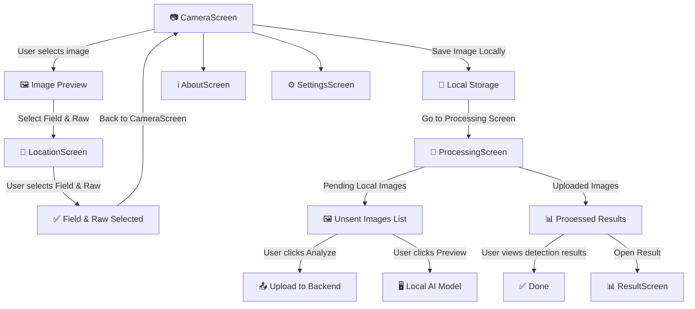

**PomoloBee App**
Since **video processing is not in scope right now**, we will focus only on **image-based apple detection**.


---
# Table of Content
<!-- TOC -->
- [Table of Content](#table-of-content)
- [**PomoloBeeApp Workflow**](#pomolobeeapp-workflow)
  - [**📌 Screen Flow Diagram**](#screen-flow-diagram)
  - [**📌 Menu**](#menu)
  - [**📌 Explanation of Flow**](#explanation-of-flow)
- [UI Frame](#ui-frame)
  - [**📷 `CameraScreen` **](#camerascreen)
    - [**Purpose**](#purpose)
    - [**📌 Main UI Elements**](#main-ui-elements)
    - [**📌 Wireframe**](#wireframe)
  - [**📍 `LocationScreen`**](#locationscreen)
    - [**Purpose**](#purpose)
    - [**Main UI Elements**](#main-ui-elements)
    - [**📌 Updated Wireframe**](#updated-wireframe)
  - [**📡 `ProcessingScreen`**](#processingscreen)
    - [**Purpose**](#purpose)
    - [**📌 Two-Part Display**](#twopart-display)
    - [**📌 Updated Wireframe**](#updated-wireframe)
  - [**📊 `ResultScreen`**](#resultscreen)
    - [**Purpose**](#purpose)
    - [**📌 Updated Wireframe**](#updated-wireframe)
  - [**📝 `SettingsScreen`**](#settingsscreen)
    - [**Purpose**](#purpose)
    - [**📌 Updated Wireframe**](#updated-wireframe)
  - [**ℹ️ `AboutScreen`**](#aboutscreen)
    - [**Purpose**](#purpose)
    - [**📌 Updated Wireframe**](#updated-wireframe)
- [Extra : Storage, navigation, error management,...](#extra--storage-navigation-error-management)
  - [Architecture](#architecture)
  - [**Offline Storage & Data Handling** ](#offline-storage--data-handling)
    - [**simple storage model:**  ](#simple-storage-model)
  - [**Syncing Behavior:**  ](#syncing-behavior)
  - [**Navigation & Fragment Flow in Android Studio** ](#navigation--fragment-flow-in-android-studio)
    - [**Navigation Diagram:** ](#navigation-diagram)
    - [**Expected Behavior for the Back Button:**  ](#expected-behavior-for-the-back-button)
  - [**Expected Device Behavior**](#expected-device-behavior)
    - [**large images strategie**  ](#large-images-strategie)
    - [**permissions** needed for camera, gallery, and storage :](#permissions-needed-for-camera-gallery-and-storage)
    - [Error management](#error-management)
  - [🛠 Debug Mode Features](#debug-mode-features)
  - [📡 API Response Handling](#api-response-handling)
  - [🛑 What If...?](#what-if)
<!-- TOC END -->

---

# **PomoloBeeApp Workflow**

## **📌 Screen Flow Diagram**


---

## **📌 Menu**
- **CameraScreen** (Default)
- **ProcessingScreen**
- **SettingsScreen**
- **AboutScreen**

---

## **📌 Explanation of Flow**
1️⃣ **User starts in `CameraScreen`** and **captures an image** or **selects from the gallery**.  
2️⃣ **User must choose a field and raw** (`LocationScreen`) and return to `CameraScreen`.  
3️⃣ **Instead of immediate upload**, the image is **saved locally** with metadata:
   - Stored in an **app-specific folder** (configurable in `SettingsScreen`).
   - Metadata (`image path`, `raw_id`, `date`) is **added to a local waiting list**.

4️⃣ **User moves to `ProcessingScreen`, which has two sections**:
   - **(A) Locally Stored (Unsent) Images**:
     - Displays images **waiting for upload**.
     - Offers two actions:
       - **"Analyze" Button** → Sends image to the backend **when online**.
       - **"Preview" Button** → Runs a **local ML model** (if available).
   - **(B) Sent & Processed Images**:
     - Shows images that have been uploaded and **already processed by the backend**.
     - Works like the original `ProcessingScreen`.

5️⃣ **After an image is uploaded**, its status appears in `ProcessingScreen` as `"Processing"` until completed.  
6️⃣ **Once processing is complete**, users can **click on an image** to view detailed results in `ResultScreen`.  
7️⃣ **Users can access `AboutScreen` anytime from `CameraScreen`.**  
8️⃣ **Users can access `SettingsScreen` anytime** to:  
   - Synchronize **fields, raws, and fruits** manually.
   - Configure the **local image storage folder**.
   - View the number of **pending images** in local storage.
 
---

# UI Frame


## **📷 `CameraScreen` **


### **Purpose**
- **Capture or load a picture**
- **Save the image information in the DataStorage**  **Stores last results for offline mode (`Jetpack DataStore`)**
- **Stores the image locally first, then allows users to manually upload it later in `ProcessingScreen`.**

### **📌 Main UI Elements**
| **Element** | **Type** | **Description** |
|------------|---------|----------------|
| **📸 Take Picture Button** | `Button` | Opens camera to take a new picture. |
| **🖼️ Upload from Gallery Button** | `Button` | Opens the gallery to select an existing image. |
| **🖼️ Selected Image Preview** | `Image` | Displays the selected image. |
| **📍 Select Location Button** | `Button` | Opens `LocationScreen` to select a **field & raw**. |
| **📌 Selected Field & Raw Label** | `Text` | Displays the **selected field & raw name**. |
| **💾 Save Image Locally Button** | `Button` | Saves image & metadata in local storage instead of uploading. |
| **📂 Storage Path Display** | `Text` | Shows where images are saved. (Configurable in Settings) |
| **➡ Navigate to ProcessingScreen** | `Navigation` | Moves to `ProcessingScreen` to manage uploads. |

### **📌 Wireframe**
```
+--------------------------------+
|  [📸 Take Picture]  [🖼️ Upload from Gallery] |
|--------------------------------|
|  🖼️ [Selected Image Preview]  |
|--------------------------------|
|  📍 Select Location: [🌱 Field] [🌿 Raw] |
|  Status: [❌ No Location Selected] |
|--------------------------------|
|  [💾 Save Image Locally]       |
|  Storage Path: /sdcard/PomoloBee/ |
+--------------------------------+
```

- **Triggered API Calls:**
  - **None**


---

## **📍 `LocationScreen`**


### **Purpose**
- Enable to select a location of the picture (raw) based on field and fruit description


### **Main UI Elements**
| **Element** | **Type** | **Description** |
|------------|---------|----------------|
| **🌱 Field Dropdown** | `Dropdown` | Lists all fields (`GET /api/fields/`). | 
| **🌿 Raw Dropdown** | `Dropdown` | Lists all raws within the selected field (`GET /api/fields/{field_id}/raws/`). |
| **✅ Confirm Button** | `Button` | Saves selection & navigates back to `CameraScreen`. |

### **📌 Updated Wireframe**
```
+--------------------------------+
|  🌱 Select Field: [Dropdown ▼] |
|  🌿 Select Raw:   [Dropdown ▼] |
|--------------------------------|
|  [✅ Confirm & Continue]       |
+--------------------------------+
```
🔹 **`Confirm & Continue Button`**  
- Ensures the user has **selected both a field and a raw** before proceeding.

 

- **Triggered API Calls:**
  - **🔄 Fetch Fields:** `GET /api/fields/` (Triggered when opening `LocationScreen`).
  - **🌿 Fetch Raws for Selected Field:** `GET /api/fields/{field_id}/raws/` (After selecting a field).
---


## **📡 `ProcessingScreen`**


### **Purpose**
### **📌 Two-Part Display**
✔ **(1) Local Images (Unsent):**  
- Shows images **waiting for upload**.
- Includes **Analyze Button** (Send to Backend) & **Preview Button** (Run Local Model).

✔ **(2) Sent & Processed Images:**  
- Displays **previously uploaded images & results**.
- Works like the old ProcessingScreen.

### **📌 Updated Wireframe**
```
+--------------------------------+
|  🔄 [Refresh Status]          |
|--------------------------------|
|  🚀 Unsent Images (Local)     |
|  🖼️ Image 1   📌 [Raw]  📅 [Date]  🔍 Preview  📤 Analyze |
|  🖼️ Image 2   📌 [Raw]  📅 [Date]  🔍 Preview  📤 Analyze |
|--------------------------------|
|  ✅ Uploaded Images (Backend) |
|  🖼️ Image 3   📅 [Date]  ✅ Done |
|  🖼️ Image 4   📅 [Date]  ⏳ Processing |
|  🖼️ Image 5   📅 [Date]  ❌ Error |
+--------------------------------+
```

- ✅ **API Calls:**
  - `POST /api/images/` (**Analyze** button → Upload to Backend)
  - `GET /api/images/{image_id}/status` (**Automatic Status Polling:** Runs every **X** seconds after an upload).  
  - `GET /api/images/` (**Manual Refresh Button:**Allows users to manually update the status). 
  - `GET /api/images/{image_id}/details/` (**Click on Image**)
  - `DELETE /api/images/{image_id}/` (**Delete Image** button)
  - `POST /api/retry_processing/` (**Retry Processing** button)
  - `GET /api/images/{image_id}/error_log` (**Refresh Status → Error Check**)

  

- **Triggered API Calls:**
  - **🔄 Refresh Status** → Fetch processing status.
  - **📤 Analyze** → Upload image to backend.
  - **🔍 Preview** → Runs a **local model** instead of calling an API.
  - **🗑 Delete Image** → Deletes an uploaded image.
  - **🔁 Retry Processing** → Requests backend to **reprocess an image**.


---
---

## **📊 `ResultScreen`**


### **Purpose**
✔ Displays **processed image** with detection markers.  
✔ Shows **apple count, estimated yield, and confidence score**.  
✔ Allows **reprocessing or sharing results**.  

### **📌 Updated Wireframe**
```
+--------------------------------+
|  🖼️ [Processed Image]         |
|                                |
|  🍏 Apples Detected: 12        |
|  📊 Estimated Yield: 48.0 kg   |
|  🎯 Confidence: 85%  [Bar]     |
|--------------------------------|
|  [🔄 Reprocess]   [📤 Share]    |
+--------------------------------+
```

- ✅ **API Calls:**
  - `GET /api/estimations/{image_id}/` (**View Results**)
  - `GET /api/latest_estimations/` (**Fetch Latest**)
  - `GET /api/history/` (**Fetch History**)
  - `GET /api/history/{history_id}/` (**Fetch Single History Record**)
- **Triggered API Calls:**
  - **📊 View Results** → Fetch yield estimation.
  - **📜 View History** → Fetch previous estimations.
---

## **📝 `SettingsScreen`**


### **Purpose**
✔ Defines **local storage path** for images.  
✔ Synchronizes **fields, raws, and fruits** for offline use.  
✔ Displays the number of **pending local images**.  
✔  **"Pending Uploads" value is fetched from local storage (`Jetpack DataStore`).**  


### **📌 Updated Wireframe**
```
+--------------------------------+
|  🌱 Tree Count:  [______]      |
|  📏 Row Length:  [______] m    |
|  🍏 Avg. Apple Size:  [______] g |
|--------------------------------|
|  📂 Image Storage Path:        |
|  /sdcard/PomoloBee/            |
|--------------------------------|
|  🔄 Sync Orchard Data Now      |
|  Pending Uploads: 3 Images     |
|--------------------------------|
|  [💾 Save]   [🔄 Sync]          |
+--------------------------------+
```

- ✅ **API Calls:**
  - `GET /api/locations/` (**Sync Orchard Data Now** button)
  - `GET /api/fields/` (**Sync Orchard Data Now** button)
  - `GET /api/fruits/` (**Sync Orchard Data Now** button)
  - `PATCH /api/raws/{raw_id}/` (**Save** button)
  - `PATCH /api/fields/{field_id}/` (**Save** button)
  - `GET /api/ml/version/` (**Debug Mode Button**)
- **Triggered API Calls:**
  - **🔄 Sync Orchard Data Now** → Fetch all fields, raws, fruits.
  - **💾 Save** → Update field/raw details.
  - **🛠 Debug Mode** → Fetch ML model version.
  

---

## **ℹ️ `AboutScreen`**


### **Purpose**
✔ Displays **app version, usage guide, developer info, and licenses**.  

### **📌 Updated Wireframe**
```
+--------------------------------+
|  ℹ️ How to use the app         |
|  🔗 GitHub repository          |
|  🔢 Version: 1.0.0             |
|  👨‍💻 Developed by Nathabee    |
|  📜 Licenses & References      |
+--------------------------------+
```

---
 
# Extra : Storage, navigation, error management,...
 
## Architecture
Android Studio
Language : Kotlin
Jetpack architecture with newest tipp (until end year 2024 minimum)
composable, no XML
theme.kt, system 
policy : Gentium 
KPS, (do not use kapt)
display : Glide
computing vision : openCV


## **Offline Storage & Data Handling** 
  - we use **Jetpack DataStore** for offline image storage   
  - Do not download an image in backend automatically with the backend when online. Allways wait for explicit synchronisation  
  - add a buton in the setting to prevent using backend (setting data will be imported from file, and analyse will just be local)

---

### **simple storage model:**  
```json
{
    "pending_images": [
        {
            "id": 1,
            "image_path": "/sdcard/PomoloBee/image1.jpg",
            "raw_id": 3,
            "date": "2024-03-15"
        }
    ]
}
```

  - images are stored :
* as file paths in local storage
* in the path of the settings (the path is changed using a picker, to be able to pick a folder on extern disk if necessary)

  - After saving the image locally, use **MediaStore API** to add it to the gallery:
```kotlin
val values = ContentValues().apply {
    put(MediaStore.Images.Media.DISPLAY_NAME, "pomolobee_${System.currentTimeMillis()}.jpg")
    put(MediaStore.Images.Media.MIME_TYPE, "image/jpeg")
    put(MediaStore.Images.Media.RELATIVE_PATH, "Pictures/PomoloBee")
}

val uri = contentResolver.insert(MediaStore.Images.Media.EXTERNAL_CONTENT_URI, values)
```
- This ensures images are **immediately visible** in the gallery.

---

   
  
## **Syncing Behavior:**  
- the app attempt to sync unsent images Manually only  

- If a user deletes an image :
if the image was not sent yet : no problem
if the image was sent, the delete image is forcing also delete in backend

- If an image **fails to upload** due to network issues:  
  - **Display an error popup.**  
  - Keep the image in the **pending list** and mark it as **"Sync Failed"**.  
  - Allow **manual retry** via a “Retry Sync” button.

---

## **Navigation & Fragment Flow in Android Studio** 


### **Navigation Diagram:** 

```mermaid 
graph TD
  A[CameraScreen] -->|Take Picture| B[Preview Image]
  B -->|Select Location| C[LocationScreen]
  C -->|Confirm| B
  B -->|Save Locally| D[ProcessingScreen]
  D -->|View Processed Images| E[ResultScreen]
  D -->|Go Back| A

- If `ProcessingScreen` contains unsent images, show:  
  ❗ "_You have unsent images. Are you sure you want to exit?_"  
  → "Yes, Exit"  
  → "No, Stay on ProcessingScreen"


```

### **Expected Behavior for the Back Button:**  
- If the user **hasn’t saved an image yet**, :  the back button is not cancelling the selection  
- If the user **has pending unsent images**, there should be a **warning message** in the topbar
- If the user **started but didn’t finish location selection**, pressing **Back** should:  
  - Return to **CameraScreen** with the **last confirmed field & raw**.  
  - **Show a toast message:** _"Location selection canceled. Using previous location."_  

-
---

## **Expected Device Behavior**
- (Performance, Storage, Permissions, Error management)

### **large images strategie**  
- Limit image resolution to **1080p** before saving.  
- Define **image compression format (JPEG, PNG, etc.)**.
 
 
### **permissions** needed for camera, gallery, and storage :

 
📌 **Required Android Permissions:**  
```xml
<uses-permission android:name="android.permission.CAMERA"/>
<uses-permission android:name="android.permission.READ_EXTERNAL_STORAGE"/>
<uses-permission android:name="android.permission.WRITE_EXTERNAL_STORAGE"/>
```

### Error management
- The app **warn the user if storage is full**
- Error encounter are always show in pop up
 
#### 📜 Error Logging & Recovery
- **All errors must be logged in `Jetpack DataStore`** under `/logs/errors.json`

- **If an API call fails** (e.g., `POST /api/images/`), retry **3 times** with exponential backoff.
 

- **Before saving an image**, check if the storage is near **90% full**:
```kotlin
val stat = StatFs(Environment.getExternalStorageDirectory().path)
val bytesAvailable = stat.availableBytes
if (bytesAvailable < 50 * 1024 * 1024) { // Less than 50MB left
   showStorageFullPopup()
}
```
- If storage is **critically low**, show **a pop-up with 3 actions**:
  1. **Free up space**
  2. **Change storage location** (external SD card)
  3. **Ignore & continue (not recommended)**


---
## 🛠 Debug Mode Features
- ✅ **Enable/Disable Backend Calls** → Prevents all API calls.
- ✅ **Use Local AI Model** → Bypasses backend ML model.
- ✅ **Manually Enter Results** → User can input fake ML detection results for testing.
- ✅ **Log API Responses** → Displays the last 10 API responses in a debug console.


## 📡 API Response Handling
| **API Call**                 | **Success**  | **Error**  | **UI Behavior** |
|------------------------------|-------------|------------|-----------------|
| `GET /api/images/{id}/status` | `"done"` → Show results | `"processing"` → Show loading icon | ✅ Display status |
| `POST /api/images/`          | `"201 Created"` → Add to uploaded list | `"400 Bad Request"` → Show popup | ✅ Retry if needed |


---

## 🛑 What If...?
- **What if the user selects a location but never saves the image?**  
  → The image remains in **temporary memory** but will not be added to the unsent list.  

- **What if the storage path becomes unavailable?**  
  → The app should **prompt the user to reselect a storage location** before saving.  

- **What if the backend API response format changes?**  
  → The app should **handle JSON parsing errors gracefully and retry if necessary**.  
