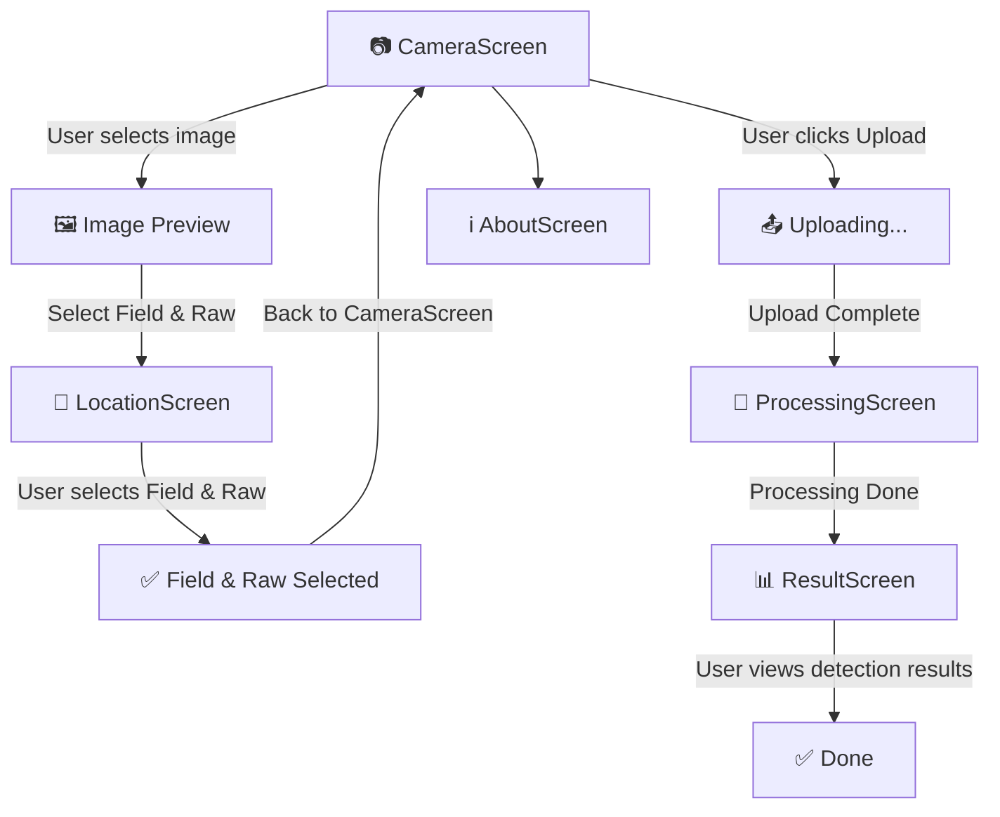

**PomoloBee App**
Since **video processing is not in scope right now**, we will focus only on **image-based apple detection**.


---
# Table of Content
<!-- TOC -->
- [Table of Content](#table-of-content)
- [**PomoloBeeApp Workflow**](#pomolobeeapp-workflow)
  - [**📌 Screen Flow Diagram**](#screen-flow-diagram)
    - [**🔍 Explanation of Flow**](#explanation-of-flow)
- [UI Frame](#ui-frame)
    - [**📌 Finalized `CameraScreen` UI Frame (Updated with Corrections)**  ](#finalized-camerascreen-ui-frame-updated-with-corrections)
  - [**📷 `CameraScreen` (Final Version)**](#camerascreen-final-version)
    - [**📌 Main UI Elements**](#main-ui-elements)
    - [**📌 Updated Wireframe**](#updated-wireframe)
  - [**📍 `LocationScreen` (NEW SCREEN)**](#locationscreen-new-screen)
    - [**Main UI Elements**](#main-ui-elements)
    - [**📌 Updated Wireframe**](#updated-wireframe)
  - [**📡 `ProcessingScreen`**](#processingscreen)
    - [**Main UI Elements (No Change)**](#main-ui-elements-no-change)
    - [**📌 Updated Wireframe**](#updated-wireframe)
  - [**📊 `ResultScreen`**](#resultscreen)
    - [**📌 Updated Wireframe**](#updated-wireframe)
  - [**📝 `SettingsScreen`**](#settingsscreen)
    - [**📌 Updated Wireframe**](#updated-wireframe)
  - [**ℹ️ `AboutScreen`**](#aboutscreen)
    - [**📌 Updated Wireframe**](#updated-wireframe)
- [**📍 Features , Screens and API Endpoints**](#features--screens-and-api-endpoints)
  - [**📌 Screen Details**](#screen-details)
    - [**📷 `CameraScreen`**](#camerascreen)
    - [**📡 `ProcessingScreen`**](#processingscreen)
    - [**📊 `ResultScreen`**](#resultscreen)
    - [**📝 `SettingsScreen`**](#settingsscreen)
  - [**📍 Workflow & API Calls in the App**](#workflow--api-calls-in-the-app)
    - [**📌 Case: App Uploads Image**](#case-app-uploads-image)
    - [**📌 Case: App Checks Processing Status**](#case-app-checks-processing-status)
    - [**📌 Case: App Fetches Estimation Results**](#case-app-fetches-estimation-results)
    - [**📌 Case: App Fetches Static Orchard Data**](#case-app-fetches-static-orchard-data)
<!-- TOC END -->

---

# **PomoloBeeApp Workflow**

## **📌 Screen Flow Diagram**


---

### **🔍 Explanation of Flow**
1️⃣ **User starts in `CameraScreen`** and **selects an image**.  
2️⃣ **User must choose a field and raw** (`LocationScreen`), then returns to `CameraScreen`.  
3️⃣ **Once the field/raw is set, user uploads the image** (`Uploading...`).  
4️⃣ **After upload, image status appears in `ProcessingScreen`**.  
5️⃣ **Once processing is complete, user can click on an image to view results in `ResultScreen`**.  
6️⃣ **The About Screen is always accessible from `CameraScreen`**.  

---

# UI Frame

### **📌 Finalized `CameraScreen` UI Frame (Updated with Corrections)**  
Your corrections make sense! Now, **two buttons (`Take Picture` & `Upload from Gallery`)** will be on top, and the **selected image** will be displayed below.

---

## **📷 `CameraScreen` (Final Version)**
### **📌 Main UI Elements**
| **Element** | **Type** | **Description** |
|------------|---------|----------------|
| **📸 Take Picture Button** | `Button` | Opens camera to take a new picture. |
| **🖼️ Upload from Gallery Button** | `Button` | Opens the gallery to select an existing image. |
| **🖼️ Selected Image Preview** | `Image` | Displays the selected image. |
| **📍 Select Location Button** | `Button` | Opens `LocationScreen` to select a **field & raw**. |
| **📌 Selected Field & Raw Label** | `Text` | Displays the **selected field & raw name**. |
| **📤 Upload Image Button** | `Button` | Sends the image **only if location is selected**. |
| **🔄 Loading Indicator** | `CircularProgressIndicator` | Shows when image is uploading. |
| **➡ Navigate to ProcessingScreen** | `Navigation` | Moves to `ProcessingScreen` after upload. |

---

### **📌 Updated Wireframe**
```
+--------------------------------+
|  [📸 Take Picture]  [🖼️ Upload from Gallery] |
|--------------------------------|
|  🖼️ [Selected Image Preview]  |
|--------------------------------|
|  📍 Select Location: [🌱 Field] [🌿 Raw] |
|  Status: [❌ No Location Selected] |
|--------------------------------|
|  [📤 Upload Image]    ⏳ [Uploading...] |
+--------------------------------+
``` 

---

## **📍 `LocationScreen` (NEW SCREEN)**
### **Main UI Elements**
| **Element** | **Type** | **Description** |
|------------|---------|----------------|
| **🌱 Field Dropdown** | `Dropdown` | Lists all fields (`GET /api/fields/`). |
| **🌿 Raw Dropdown** | `Dropdown` | Lists all raws within the selected field (`GET /api/fields/{field_id}/raws/`). |
| **✅ Confirm Button** | `Button` | Saves selection & navigates back to `CameraScreen`. |

### **📌 Updated Wireframe**
```
+--------------------------------+
|  🌱 Select Field: [Dropdown ▼] |
|  🌿 Select Raw:   [Dropdown ▼] |
|--------------------------------|
|  [✅ Confirm & Continue]       |
+--------------------------------+
```
🔹 **New Element: `Confirm & Continue Button`**  
- Ensures the user has **selected both a field and a raw** before proceeding.

---

## **📡 `ProcessingScreen`**
### **Main UI Elements (No Change)**
✔ Displays **list of uploaded images & processing status**.  
✔ Allows **refreshing status** and **clicking on completed images** to view results.  

### **📌 Updated Wireframe**
```
+--------------------------------+
|  🔄 [Refresh Status]          |
|--------------------------------|
|  🖼️ Image 1   📅 [Date]  ✅ Done |
|  🖼️ Image 2   📅 [Date]  ⏳ Processing |
|  🖼️ Image 3   📅 [Date]  ❌ Error |
|--------------------------------|
|  (Click on a "Done" image to)  |
|  (view detailed results)       |
+--------------------------------+
```
---

## **📊 `ResultScreen`**
✔ Displays **processed image** with detection markers.  
✔ Shows **apple count, estimated yield, and confidence score**.  
✔ Allows **reprocessing or sharing results**.  

### **📌 Updated Wireframe**
```
+--------------------------------+
|  🖼️ [Processed Image]         |
|                                |
|  🍏 Apples Detected: 12        |
|  📊 Estimated Yield: 48.0 kg   |
|  🎯 Confidence: 85%  [Bar]     |
|--------------------------------|
|  [🔄 Reprocess]   [📤 Share]    |
+--------------------------------+
```
---

## **📝 `SettingsScreen`**
✔ Stores **tree count, row length, and apple size** for **yield adjustments**.  
✔ Syncs **orchard details from the backend**.  

### **📌 Updated Wireframe**
```
+--------------------------------+
|  🌱 Tree Count:  [______]      |
|  📏 Row Length:  [______] m    |
|  🍏 Avg. Apple Size:  [______] g |
|--------------------------------|
|  [💾 Save]   [🔄 Sync]          |
+--------------------------------+
```
---

## **ℹ️ `AboutScreen`**
✔ Displays **app version, usage guide, developer info, and licenses**.  

### **📌 Updated Wireframe**
```
+--------------------------------+
|  ℹ️ How to use the app         |
|  🔗 GitHub repository          |
|  🔢 Version: 1.0.0             |
|  👨‍💻 Developed by Nathabee    |
|  📜 Licenses & References      |
+--------------------------------+
```

---
 

# **📍 Features , Screens and API Endpoints**
  
This table assigns each **feature** to the appropriate **screen** in the app.

| **Category**            | **Feature**                                   | **API Usage**                       | **Screen Name**        |
|-------------------------|----------------------------------------------|--------------------------------------|------------------------|
| **📷 Image Handling**   | Capture or upload image                      | No API (Local)                      | `CameraScreen`        |
| **📤 Image Processing** | Upload image for apple detection             | `POST /api/images/`                 | `CameraScreen`        |
| **📡 Status Check**     | Check if image processing is done            | `GET /api/images/{image_id}/status` | `ProcessingScreen`    |
| **📊 Yield Estimation** | Fetch apple detection results                | `GET /api/estimations/{image_id}`   | `ResultScreen`        |
| **📝 User Input**       | Manually input tree & orchard details        | No API (Local DataStore)            | `SettingsScreen`      |
| **📥 Data Sync**        | Fetch orchard parameters                     | `GET /api/static_data/`             | `SettingsScreen`      |
| **🔄 Offline Mode**     | Store last results locally                   | No API (Jetpack DataStore)          | `SettingsScreen`      |

---

## **📌 Screen Details**
### **📷 `CameraScreen`**
- **Capture a picture**
- **Upload the image to the backend**
- **Navigate to `ProcessingScreen` after submission**

### **📡 `ProcessingScreen`**
- **Checks the status of the image processing**
- **Polls `GET /api/images/{image_id}/status`**
- **Once processing is complete, navigates to `ResultScreen`**

### **📊 `ResultScreen`**
- **Fetches the final yield estimation**
- **Displays apple count, yield per plant, and total yield**
- **Allows users to confirm or retake a picture**

### **📝 `SettingsScreen`**
- **Allows users to input orchard details (tree count, row length, apple size)**
- **Syncs orchard settings from backend (`GET /api/static_data/`)**
- **Stores last results for offline mode (`Jetpack DataStore`)**

---
 
---

## **📍 Workflow & API Calls in the App**

### **📌 Case: App Uploads Image**
1️⃣ **User takes a picture or selects an image from the gallery**  
2️⃣ **App sends image to backend**  
   - **API:** `POST /api/images/`
   - **Payload:** `{ image: file, raw_id: int, date: string }`
   - **Response:** `{ image_id: int }`
3️⃣ **App stores `image_id` and shows a loading screen**

---

### **📌 Case: App Checks Processing Status**
1️⃣ **App starts polling to check if processing is complete**  
   - **API:** `GET /api/images/{image_id}/status`
   - **Response:** `{ status: "processing" | "done" }`
2️⃣ **If status is `"done"`, app proceeds to fetch results**  
3️⃣ **If status remains `"processing"` after 5 minutes, app displays a timeout error**

---

### **📌 Case: App Fetches Estimation Results**
1️⃣ **App calls API to get detection results**  
   - **API:** `GET /api/estimations/{image_id}`
   - **Response:**
   ```json
   {
       "plant_apfel": 12,
       "plant_kg": 2.4,
       "raw_kg": 48.0,
       "confidence_score": 0.85,
       "status": "done"
   }
   ```
2️⃣ **App displays estimated apple count and yield**
3️⃣ **User can manually adjust settings (tree count, row length, apple size)**

---

### **📌 Case: App Fetches Static Orchard Data**
1️⃣ **Fetch orchard settings (fields, trees, fruit data) from backend**  
   - **API:** `GET /api/static_data/`
   - **Response:**
   ```json
   {
       "fields": [...],
       "raws": [...],
       "fruits": [...]
   }
   ```
2️⃣ **Store locally in DataStore for offline use**

---
 