**PomoloBee App**
Since **video processing is not in scope right now**, we will focus only on **image-based fruit detection**.


---
# Table of Content
<details>
<summary>Table of Content</summary>
 
<!-- TOC -->
- [Table of Content](#table-of-content)
- [**PomoloBeeApp Workflow**](#pomolobeeapp-workflow)
  - [**Screen Flow Diagram**](#screen-flow-diagram)
  - [**Menu**](#menu)
  - [**Explanation of Flow**](#explanation-of-flow)
- [UI Frame](#ui-frame)
  - [**`CameraScreen`**](#camerascreen)
    - [**Purpose**](#purpose)
    - [**Main UI Elements**](#main-ui-elements)
    - [**Wireframe**](#wireframe)
  - [**`LocationScreen`**](#locationscreen)
    - [**Purpose**](#purpose)
    - [**Main UI Elements**](#main-ui-elements)
    - [**Updated Wireframe**](#updated-wireframe)
  - [**`SvgMapScreen`**](#svgmapscreen)
    - [**Purpose**](#purpose)
    - [**Main UI Elements**](#main-ui-elements)
    - [**Updated Wireframe**](#updated-wireframe)
  - [**`ProcessingScreen`**](#processingscreen)
    - [**Purpose**](#purpose)
    - [**Two-Part Display**](#two-part-display)
    - [**Updated Wireframe**](#updated-wireframe)
    - [**API Calls**](#api-calls)
    - [**Polling Strategy**](#polling-strategy)
    - [**Triggered API Behavior**](#triggered-api-behavior)
  - [**`ResultScreen`**](#resultscreen)
    - [**Purpose**](#purpose)
    - [**Updated Wireframe**](#updated-wireframe)
  - [**`SettingsScreen`**](#settingsscreen)
    - [**Purpose**](#purpose)
    - [**New Feature Test Connection**](#new-feature-test-connection)
    - [**Wireframe**](#wireframe)
    - [API Calls](#api-calls)
  - [**`OrchardScreen`**](#orchardscreen)
    - [**Purpose**](#purpose)
    - [**Wireframe**](#wireframe)
  - [**ℹ️ `AboutScreen`**](#i-aboutscreen)
    - [**Purpose**](#purpose)
    - [**Updated Wireframe**](#updated-wireframe)
- [Extra Storage navigation error management...](#extra-storage-navigation-error-management)
  - [Architecture](#architecture)
  - [**Offline Storage Data Handling**](#offline-storage-data-handling)
    - [**simple storage model**](#simple-storage-model)
  - [**Syncing Behavior**](#syncing-behavior)
  - [**Navigation Fragment Flow in Android Studio**](#navigation-fragment-flow-in-android-studio)
    - [**Navigation Diagram**](#navigation-diagram)
    - [**Expected Behavior for the Back Button**](#expected-behavior-for-the-back-button)
  - [**Expected Device Behavior**](#expected-device-behavior)
    - [**large images strategie**](#large-images-strategie)
    - [**permissions** needed for camera gallery and storage](#permissions-needed-for-camera-gallery-and-storage)
    - [Error management](#error-management)
  - [Debug Mode Features](#debug-mode-features)
  - [API Response Handling](#api-response-handling)
  - [What If...?](#what-if)
<!-- TOC END -->
 
</details>

---

# **PomoloBeeApp Workflow**

## **Screen Flow Diagram**

```mermaid
graph TD  
  A[📷 CameraScreen] -->|User selects image| B[🖼️ Image Preview]
  B -->|Select Field & Raw| L[📍 LocationScreen]
  L -->|Select Field| L1[Field Selected]
  L1 -->|Dropdown Raw| L2[Raw Selected from Dropdown]
  L1 -->|Select from Image| M[🗺️ SvgMapScreen]
  M -->|Tap Row & Confirm| L3[Raw Selected from SVG]
  L2 -->|Confirm| B1[✅ Location Confirmed]
  L3 -->|Confirm| B1

  B1 -->|Back to CameraScreen| A
  A -->|Save Image Locally| S[💾 Local Storage]

  S -->|Go to Processing Screen| D[📡 ProcessingScreen]
  D -->|Pending Local Images| U[🖼️ Unsent Images List]
  U -->|Analyze| X[📤 Upload to Backend]
  U -->|Preview| Y[🖥️ Local AI Model]

  D -->|Uploaded Images| E[📊 Processed Results]
  E -->|Open Result| R[📊 ResultScreen]

  A --> G[ℹ️ AboutScreen]
  A --> H1[⚙️ SettingsScreen]
  A --> H2[🌳 OrchardScreen]
  H2 -->|Visualize Field| M

```


---

## **Menu**
- **CameraScreen** (Default)
- **ProcessingScreen**
- **SettingsScreen**
- **OrchardScreen**
- **AboutScreen**

---

## **Explanation of Flow**
once :  **Users access `SettingsScreen`** to synchronize **fields, raws, and fruits** manually.

1️⃣ **User starts in `CameraScreen`** and captures an image or selects from the gallery.  
2️⃣ User taps **"Select Location"**, which opens `LocationScreen`.

3️⃣ In `LocationScreen`, the user:
- Selects a **field** from a dropdown.
- Then **either**:
  - Selects a **raw from a dropdown**, or  
  - Taps **"Select from Image"**, which opens `SvgMapScreen` to pick a raw visually.

4️⃣ In `SvgMapScreen`, the field’s SVG layout is shown.  
The user taps on a raw and confirms the selection, which returns to `LocationScreen`.  
(Only one raw can be selected.)

5️⃣ After selecting both field and raw, the user taps **"Confirm & Continue"**, returning to `CameraScreen`.  
The app now shows the selected field and raw.

6️⃣ The image is saved **locally**, not uploaded immediately.

7️⃣ User navigates to `ProcessingScreen`, where:
- All **unsent images** are listed, each with:
  - **Analyze** → sends to backend  
  - **Preview** → runs local ML (if available)
- Previously uploaded and processed images appear below with status.

8️⃣ Once an image is processed, the user can open it in `ResultScreen` to see:
- Detected fruit
- Estimated yield
- Confidence score

9️⃣ User can also visit:
- **SettingsScreen** → to sync orchard data, configure paths, or debug  
- **OrchardScreen** → view fields/rows & visualize SVG maps (read-only)
- **AboutScreen** → view version, GitHub, etc.

---

# UI Frame


## **`CameraScreen`**


### **Purpose**
- **Capture or load a picture**
- **Save the image information in the DataStorage**  **Stores last results for offline mode (`Jetpack DataStore`)**
- **Stores the image locally first, then allows users to manually upload it later in `ProcessingScreen`.**

### **Main UI Elements**
| **Element** | **Type** | **Description** |
|------------|---------|----------------|
| **📸 Take Picture Button** | `Button` | Opens camera to take a new picture. |
| **🖼️ Upload from Gallery Button** | `Button` | Opens the gallery to select an existing image. |
| **🖼️ Selected Image Preview** | `Image` | Displays the selected image. |
| **📍 Select Location Button** | `Button` | Opens `LocationScreen` to select a **field & raw**. |
| **📌 Selected Field & Raw Label** | `Text` | Displays the **selected field & raw name**. |
| **💾 Save Image Locally Button** | `Button` | Saves image & metadata in local storage instead of uploading. |
| **📂 Storage Path Display** | `Text` | Shows where images are saved. (Configurable in Settings) |
| **➡ Navigate to ProcessingScreen** | `Navigation` | Moves to `ProcessingScreen` to manage uploads. |

### **Wireframe**
```
+--------------------------------+
|  [📸 Take Picture]  [🖼️ Upload from Gallery] |
|--------------------------------|
|  🖼️ [Selected Image Preview]  |
|--------------------------------|
|  📍 Select Location: [🌱 Field] [🌿 Raw] |
|  Status: [❌ No Location Selected] |
|--------------------------------|
|  [💾 Save Image Locally]       |
|  Storage Path: /sdcard/PomoloBee/ |
+--------------------------------+
```

- **Triggered API Calls:**
  - **None**


---

## **`LocationScreen`**


### **Purpose**
- Enable to select a location of the picture (raw) based on field and fruit description

 
### **Main UI Elements**
| **Element** | **Type** | **Description** |
|------------|---------|----------------|
| **🌱 Field Dropdown** | `Dropdown` | Lists fields are retrieved from storage. | 
| **🌿 Raw Dropdown** | `Dropdown` | Lists all raws within the selected field retrieved from storage . |
| **✅ select from image** | `Button` | open a sren that shows the selected field to select a raw instead of selecting from cmbobox `SvgMapScreen`. |
| **✅ Confirm Button** | `Button` | Saves selection & navigates back to `CameraScreen`. |

### **Updated Wireframe**
```
+--------------------------------+
|  🌱 Select Field: [Dropdown ▼] |
|  🌿 Select Raw:   [Dropdown ▼] [select from image]|
|--------------------------------|
|  [✅ Confirm & Continue]       |
+--------------------------------+
```
🔹 **`select from image Button`**  
- Ensures the user has **selected a field* before opening SvgMapScreen.

🔹 **`Confirm & Continue Button`**  
- Ensures the user has **selected both a field and a raw** before proceeding.

 

- **Triggered API Calls:**
**none**

 


---

 

## **`SvgMapScreen`**


### **Purpose**
- Enable to select a location of the (raw) by selecting a Raw on a SVG field representation (field shown is the one selected before )

 
### **Main UI Elements**
| **Element** | **Type** | **Description** |
|------------|---------|----------------|
| 🖼️ SVG Field View | `Interactive SVG Image` | Displays the selected field's layout. Rows are tappable regions in the SVG. |
| **✅ Confirm Button** | `Button` | Saves selection & navigates back to `CameraScreen`. |

### **Updated Wireframe**
```
+--------------------------------+
+--------------------------------+
|  🖼️ [SVG Field View]           |
|  📍 Selected Raw: raw_4        |
|--------------------------------|
|  [✅ Confirm & Continue]       |
+--------------------------------+
 
``` 

🔹 **`Confirm & Continue Button`**  
- Ensures the user has **selected a raw** before proceeding.

 

- **Triggered API Calls:**
**none**

 


---
 
## **`ProcessingScreen`**

### **Purpose**
- Manage the lifecycle of captured images, from local storage to backend processing  
- Display their processing status and results  

---

### **Two-Part Display**

✔ **(1) Local Images (Unsent):**  
- Shows images **waiting for upload**  
- Includes:
  - **📤 Analyze** → Sends to backend  
  - **🔍 Preview** → Runs local ML (offline)

✔ **(2) Uploaded Images (Processed/Pending):**  
- Shows all **images already uploaded** to Django  
- Displays their **processing status** and allows reprocessing

---

### **Updated Wireframe**
```
+--------------------------------+
|  🔄 [Refresh Status]          |
|--------------------------------|
|  🚀 Unsent Images (Local)     |
|  🖼️ Image 1   📌 [Raw]  📅 [Date]  🔍 Preview  📤 Analyze |
|  🖼️ Image 2   📌 [Raw]  📅 [Date]  🔍 Preview  📤 Analyze |
|--------------------------------|
|  ✅ Uploaded Images (Backend) |
|  🖼️ Image 3   📅 [Date]  ✅ Done |
|  🖼️ Image 4   📅 [Date]  ⏳ Processing |
|  🖼️ Image 5   📅 [Date]  ❌ Error |
+--------------------------------+
```

---

### **API Calls**
| Action | Endpoint |
|--------|----------|
| Upload image | `POST /api/images/` |
| Poll image status | `GET /api/images/{image_id}/details/` |
| Get result (if processed) | `GET /api/images/{image_id}/estimations/` |
| Delete image | `DELETE /api/images/{image_id}/` |
| Retry processing | `POST /api/retry_processing/` |
| Manual refresh | `GET /api/images/` |
| Debug error log (optional) | `GET /api/images/{image_id}/error_log/` |

---

### **Polling Strategy**
- The app checks `GET /api/images/{image_id}/details/` every **60 seconds**
- If `status = "Done"` and `processed = true`, the app calls:  
  → `GET /api/images/{image_id}/estimations/`
- If `status = "Processing"` after **5 retries**, app shows a warning:
  > “Processing is taking too long. You may retry or continue later.”
- After 5 retries:
  - App **stops polling**
  - Django may choose to **automatically retry ML call**
  - User can **manually retry** via UI

---

### **Triggered API Behavior**
| UI Action | Behavior |
|-----------|----------|
| 🔄 Refresh Status | Reloads all image states from backend |
| 📤 Analyze | Uploads image to Django |
| 🔍 Preview | Uses local ML model |
| 🔁 Retry Processing | Triggers Django to re-send image to ML |
| 🗑 Delete Image | Removes image from backend & app |
| ⏳ Processing → ✅ Done | App detects status change via polling and fetches results |

---
 

## **`ResultScreen`**


### **Purpose**
✔ Displays **processed image** with detection markers.  
✔ Shows **fruit count, estimated yield, and confidence score**.  
✔ Allows **reprocessing or sharing results**.  

### **Updated Wireframe**
```
+--------------------------------+
|  🖼️ [Processed Image]         |
|                                |
|  🍏 fruit Detected: 12        |
|  📊 Estimated Yield: 48.0 kg   |
|  🎯 Confidence: 85%  [Bar]     |
|--------------------------------|
|  [🔄 Reprocess]   [📤 Share]    |
+--------------------------------+
```

- ✅ **API Calls:**
  - `GET /api/estimations/{image_id}/` (**View Results**)
  - `GET /api/latest_estimations/` (**Fetch Latest**)
  - `GET /api/history/` (**Fetch History**)
  - `GET /api/history/{history_id}/` (**Fetch Single History Record**)
- **Triggered API Calls:**
  - **📊 View Results** → Fetch yield estimation.
  - **📜 View History** → Fetch previous estimations.
---
 
## **`SettingsScreen`**

### **Purpose**

This screen must be used **at least once during the first app launch** to synchronize orchard data (fields, raws, fruits). Without this step, the app cannot assign location metadata to photos or perform yield estimations.

This screen enables users to:

- **Configure and test** the base API and Media URLs
- **Synchronize essential orchard data**
- **Set the image storage path**
- **View and manage pending uploads**

---

🧠 **Orchard data is required** for using the app — without it, users cannot assign location metadata to images or run yield estimation.

✔ Displays the number of **pending local images**  
✔ All user input is saved using **Jetpack DataStore**

---

| **Setting**        | **Description** |
|--------------------|-----------------|
| `DJANGO_API_URL`   | Used for all backend communication (`/api/...`) |
| `DJANGO_MEDIA_URL` | Used for all media access (`/media/...`) |

---

### **New Feature Test Connection**

📌 The **Test Connection** button verifies both endpoints:

- Sends a `GET /api/ml/version/` to `DJANGO_API_URL`
- Sends a `HEAD` or `GET` to `{DJANGO_MEDIA_URL}/media/svg/fields/default_map.svg`

✅ **Success:**  
→ Show green check: `"Connection OK"`

❌ **Failure:**  
→ Show error popup:  
- `"Cannot reach Django API"` or  
- `"Cannot reach media endpoint"`  
→ Suggest the user to check the URL values

---

### **Wireframe**
```
+--------------------------------+
|  🌱 Tree Count:     [______]   |
|  📏 Row Length:     [______] m |
|  🍏 Avg. Fruit Size: [______] g |
|--------------------------------|
|  📂 API Endpoint:              |
|  https://api.pomolobee.com     |
|  📂 Media Endpoint:            |
|  https://media.pomolobee.com   |
|  [🔌 Test Connection] ✅        |
|--------------------------------|
|  📂 Image Storage Path:        |
|  /sdcard/PomoloBee/            |
|--------------------------------|
|  [💾 Save Settings]            |
|--------------------------------|
|  🔄 Sync Orchard Data Now      |
|  Pending Uploads: 3 Images     |
|--------------------------------|
|  Last Sync: 2025-03-30 10:00   |
|  [🔄 Sync Now]                 |
+--------------------------------+

```

---

### API Calls

| Trigger | Endpoint | Purpose |
|--------|----------|---------|
| `🔄 Sync Orchard Data` | `GET /api/locations/` | Combined field + raw |
|                        | `GET /api/fields/`    | Orchard details |
|                        | `GET /api/fruits/`    | Fruit types |
| `🔌 Test Connection` | `GET /api/ml/version/` | Verifies API endpoint |
|                      | `HEAD /media/svg/fields/default_map.svg` | Verifies media access |
| `🛠 Debug Mode`      | `GET /api/ml/version/` | Show model version |
| `💾 Save`            | _none_ | Locally stores settings in DataStore |

---
 


## **`OrchardScreen`**

### **Purpose**
✔ Display all **fields (orchards)** and their respective **tree rows (raws)**  
✔ Allow users to **view structure, orientation, and fruit types**  
✔ Acts as a **read-only orchard overview**, paving the way for future field/raw editing  
 

---

### **Wireframe**
```
+----------------------------------------+
| 🌳 Orchard: North Orchard (N)          |
| 📝 Description: Main fruit section     |
| 📝 Visualize button    |
|----------------------------------------|
| 🌿 Row A  • 50 trees • 🍏 Golden fruit  |
| 🌿 Row B  • 40 trees • 🍎 Red fruit     |
|----------------------------------------|
| 🌳 Orchard: South Orchard (S)          |
| 📝 Description: Mixed fruit section    |
| 📝 Visualize button    |
|----------------------------------------|
| 🌿 Row C  • 45 trees • 🍏 Green fruit   |
+----------------------------------------+
```
 
The "Visualize" button allows users to preview the layout of a field. Unlike the `LocationScreen`, raw selection is **optional** and no changes are applied.
---

- ✅ **API Calls (Read-Only):**
  - `GET /api/locations/` (used to fetch fields and raws in a single request)

- ❌ **No Edit Capability Yet:**
  - Future support for:
    - `PATCH /api/fields/{field_id}/`
    - `PATCH /api/raws/{raw_id}/`

---

## **ℹ️ `AboutScreen`**


### **Purpose**
✔ Displays **app version, usage guide, developer info, and licenses**.  

### **Updated Wireframe**
```
+--------------------------------+
|  ℹ️ How to use the app         |
|  🔗 GitHub repository          |
|  🔢 Version: 1.0.0             |
|  👨‍💻 Developed by Nathabee    |
|  📜 Licenses & References      |
+--------------------------------+
```

---
 
# Extra Storage navigation error management...
 
## Architecture
Android Studio
Language : Kotlin
Jetpack architecture with newest tipp (until end year 2024 minimum)
composable, no XML
theme.kt, system 
policy : Gentium 
KPS, (do not use kapt)
display : Glide
computing vision : openCV


## **Offline Storage Data Handling**
  - we use **Jetpack DataStore** for offline image storage   
  - Do not download an image in backend automatically with the backend when online. Allways wait for explicit synchronisation  
  - add a buton in the setting to prevent using backend (setting data will be imported from file, and analyse will just be local)

---

### **simple storage model**
```json
{
    "pending_images": [
        {
            "id": 1,
            "image_path": "/sdcard/PomoloBee/image1.jpg",
            "raw_id": 3,
            "date": "2024-03-15"
        }
    ]
}
```

  - images are stored :
* as file paths in local storage
* in the path of the settings (the path is changed using a picker, to be able to pick a folder on extern disk if necessary)

  - After saving the image locally, use **MediaStore API** to add it to the gallery:
```kotlin
val values = ContentValues().apply {
    put(MediaStore.Images.Media.DISPLAY_NAME, "pomolobee_${System.currentTimeMillis()}.jpg")
    put(MediaStore.Images.Media.MIME_TYPE, "image/jpeg")
    put(MediaStore.Images.Media.RELATIVE_PATH, "Pictures/PomoloBee")
}

val uri = contentResolver.insert(MediaStore.Images.Media.EXTERNAL_CONTENT_URI, values)
```
- This ensures images are **immediately visible** in the gallery.

---

   
  
## **Syncing Behavior**
- the app attempt to sync unsent images Manually only  

- If a user deletes an image :
if the image was not sent yet : no problem
if the image was sent, the delete image is forcing also delete in backend

- If an image **fails to upload** due to network issues:  
  - **Display an error popup.**  
  - Keep the image in the **pending list** and mark it as **"Sync Failed"**.  
  - Allow **manual retry** via a “Retry Sync” button.

---

## **Navigation Fragment Flow in Android Studio**


### **Navigation Diagram**

```mermaid 
graph TD
  A[CameraScreen] -->|Take Picture| B[Preview Image]
  B -->|Select Location| C[LocationScreen]
  C -->|Confirm| B
  B -->|Save Locally| D[ProcessingScreen]
  D -->|View Processed Images| E[ResultScreen]
  D -->|Go Back| A

- If `ProcessingScreen` contains unsent images, show:  
  ❗ "_You have unsent images. Are you sure you want to exit?_"  
  → "Yes, Exit"  
  → "No, Stay on ProcessingScreen"


```

### **Expected Behavior for the Back Button**
- If the user **hasn’t saved an image yet**, :  the back button is not cancelling the selection  
- If the user **has pending unsent images**, there should be a **warning message** in the topbar
- If the user **started but didn’t finish location selection**, pressing **Back** should:  
  - Return to **CameraScreen** with the **last confirmed field & raw**.  
  - **Show a toast message:** _"Location selection canceled. Using previous location."_  

-
---

## **Expected Device Behavior**
- (Performance, Storage, Permissions, Error management)

### **large images strategie**
- Limit image resolution to **1080p** before saving.  
- Define **image compression format (JPEG, PNG, etc.)**.
 
 
### **permissions** needed for camera gallery and storage

 
📌 **Required Android Permissions:**  
```xml
<uses-permission android:name="android.permission.CAMERA"/>
<uses-permission android:name="android.permission.READ_EXTERNAL_STORAGE"/>
<uses-permission android:name="android.permission.WRITE_EXTERNAL_STORAGE"/>
```

### Error management
- The app **warn the user if storage is full**
- Error encounter are always show in pop up
 
#### Error Logging Recovery
- **All errors must be logged in `Jetpack DataStore`** under `/logs/errors.json`

- **If an API call fails** (e.g., `POST /api/images/`), retry **3 times** with exponential backoff.
 

- **Before saving an image**, check if the storage is near **90% full**:
```kotlin
val stat = StatFs(Environment.getExternalStorageDirectory().path)
val bytesAvailable = stat.availableBytes
if (bytesAvailable < 50 * 1024 * 1024) { // Less than 50MB left
   showStorageFullPopup()
}
```
- If storage is **critically low**, show **a pop-up with 3 actions**:
  1. **Free up space**
  2. **Change storage location** (external SD card)
  3. **Ignore & continue (not recommended)**


---
## Debug Mode Features
- ✅ **Enable/Disable Backend Calls** → Prevents all API calls.
- ✅ **Use Local AI Model** → Bypasses backend ML model.
- ✅ **Manually Enter Results** → User can input fake ML detection results for testing.
- ✅ **Log API Responses** → Displays the last 10 API responses in a debug console.


## API Response Handling
| **API Call**                 | **Success**  | **Error**  | **UI Behavior** |
|------------------------------|-------------|------------|-----------------|
| `GET /api/images/{id}/status` | `"done"` → Show results | `"processing"` → Show loading icon | ✅ Display status |
| `POST /api/images/`          | `"201 Created"` → Add to uploaded list | `"400 Bad Request"` → Show popup | ✅ Retry if needed |


---

## What If...?
- **What if the user selects a location but never saves the image?**  
  → The image remains in **temporary memory** but will not be added to the unsent list.  

- **What if the storage path becomes unavailable?**  
  → The app should **prompt the user to reselect a storage location** before saving.  

- **What if the backend API response format changes?**  
  → The app should **handle JSON parsing errors gracefully and retry if necessary**.  
