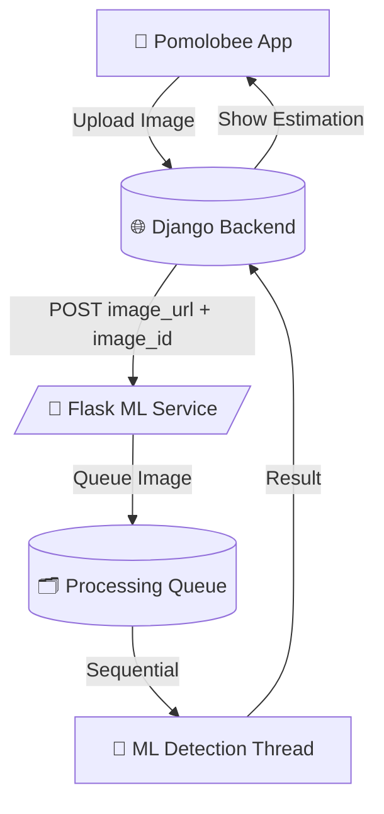

# **ML Specification Pomolobee AI Processing Phase 1**

---

<details>
<summary>Table of Content</summary>

<!-- TOC -->
- [**ML Specification Pomolobee AI Processing Phase 1**](#ml-specification-pomolobee-ai-processing-phase-1)
- [**ML Specification Pomolobee AI Processing Phase 1**](#ml-specification-pomolobee-ai-processing-phase-1)
  - [**1. Purpose**](#1-purpose)
  - [**2. Overview**](#2-overview)
    - [️ Architecture Components](#architecture-components)
  - [**3. Execution Model**](#3-execution-model)
    - [Flask Request Handling Multi-threaded](#flask-request-handling-multi-threaded)
    - [️ ML Worker Sequential Inference](#ml-worker-sequential-inference)
  - [**4. Processing Flow Summary**](#4-processing-flow-summary)
  - [**5. Threading Performance Notes**](#5-threading-performance-notes)
  - [**6. Deployment Assumptions Phase 1**](#6-deployment-assumptions-phase-1)
  - [**7. Folder File Structure**](#7-folder-file-structure)
  - [**8. Data Collection Annotation**](#8-data-collection-annotation)
    - [️ Source](#source)
    - [️ Labeling Guidelines](#labeling-guidelines)
    - [Dataset Structure](#dataset-structure)
  - [**9. Training Process**](#9-training-process)
    - [️ Steps](#steps)
  - [**10. Inference / ML Execution**](#10-inference-ml-execution)
  - [**11. Mocking ML for Django Testing**](#11-mocking-ml-for-django-testing)
  - [**12. Unit Testing ML Service**](#12-unit-testing-ml-service)
<!-- TOC END -->
  
</details>
---
Your draft is already strong and well-structured! Here’s the **corrected and completed version** of your ML specification — polished, aligned with your codebase, and clearly organized for both devs and collaborators.

---

# **ML Specification Pomolobee AI Processing Phase 1**

---

## **1. Purpose**

The **Pomolobee ML microservice** is a standalone backend component responsible for:

- 🍎 Detecting apples in orchard images  
- 📈 Estimating yield based on apple count  
- 🧠 Performing basic object detection via a simulated or real model (e.g. YOLOv8)  
- 🔁 Communicating results asynchronously back to Django  

**Key Features**:
- 🧵 Thread-safe and non-blocking request handling
- 🧠 Sequential ML inference ensures resource efficiency  
- 📡 Decoupled HTTP interface and processing loop  
- 🚀 Easily extensible (YOLOv8, OpenCV, TFLite, etc.)

---

## **2. Overview**

The ML service is implemented in **Flask** and listens for HTTP POST requests to process images asynchronously.

### ️ Architecture Components

| Component          | Description                                                  |
|-------------------|--------------------------------------------------------------|
| `Flask App`       | Receives image processing requests at `/ml/process-image`    |
| `Background Thread`| Continuously monitors queue and runs detection sequentially |
| `Queue (Dict)`    | In-memory task queue tracking `image_id`, path, and status   |
| `OpenCV + NumPy`  | Simulates detection (can be replaced by YOLOv8 model)        |



---

## **3. Execution Model**

### Flask Request Handling Multi-threaded

- Flask uses a **threaded HTTP server** to accept multiple incoming requests in parallel
- Enqueues image tasks quickly without performing ML inline

### ️ ML Worker Sequential Inference

- `background_process_images()` runs in a loop
- **Only one image processed at a time**
- Avoids GPU/CPU spikes on low-end servers or edge devices

```python
while True:
    for image_id, data in processing_queue.items():
        if data["status"] == "processing":
            # Run detection
```

✅ Flask remains responsive even if ML is busy

---

## **4. Processing Flow Summary**

1. ✅ **Django** sends POST to `/ml/process-image`  
2. ✅ **Flask** downloads image and adds it to `processing_queue`  
3. 🔁 **Background thread** processes images one by one  
4. 📬 Result posted back to Django at `/api/images/{image_id}/ml_result`

---

## **5. Threading Performance Notes**

| Feature | Status |
|--------|--------|
| Flask parallel requests | ✅ Enabled (multi-threaded) |
| ML inference | 🧵 Sequential (1 image at a time) |
| Queue mechanism | 🧠 In-memory Python dict |
| Future scaling | 🔜 FastAPI + multiprocessing support possible |
| Image persistence | ❌ Not permanent – stored temporarily in `/uploads/` |

---

## **6. Deployment Assumptions Phase 1**

| Aspect         | Value                  |
|----------------|------------------------|
| Runtime        | Flask + threading      |
| ML Model       | Simulated or YOLOv8    |
| Inference Mode | Background-only        |
| Device         | CPU only (no GPU)      |
| Scaling        | Manual or containerized|

---

## **7. Folder File Structure**

```bash
PomoloBeeML/
├── app.py               # Main Flask application
├── config.py            # ML config constants
├── requirements.txt     # Python dependencies
├── utils.py             # Download helper, validation
├── uploads/             # Downloaded images (temporary)
├── data/                # to train teh model
├── model/               # Real or simulated ML model logic
│   ├── detect.py        # Actual detection logic (e.g. YOLO wrapper)
│   ├── yolo_utils.py    # Helper for YOLO results
│   └── README.md
├── static/              # Optional assets (for future UI/debug)
├── tests/
│   └── test_flask.py    # Flask API tests
├── venv/                # Local virtual environment
```

---

## **8. Data Collection Annotation**

### ️ Source

- Captured via **Pomolobee app**, uploaded via Django
- Or imported from public datasets (e.g. AppleA, Roboflow)

### ️ Labeling Guidelines

- **Tool**: Roboflow, LabelImg, or CVAT
- **Format**: YOLO TXT format
  ```
  class_id x_center y_center width height
  ```

### Dataset Structure

```bash
data/
├── images/
│   ├── train/
│   └── val/
├── labels/
│   ├── train/
│   └── val/
└── data.yaml   # YOLOv8 config
```

Example `data.yaml`:
```yaml
train: ./images/train
val: ./images/val
nc: 1
names: ["apple"]
```

---

## **9. Training Process**

📌 Goal: Train a **YOLOv8** object detector to count apples.

### ️ Steps

1. **Install**:
```bash
pip install ultralytics
```

2. **Prepare `data.yaml`**:
```yaml
path: ./data
train: images/train
val: images/val
nc: 1
names: ["apple"]
```

3. **Train**:
```bash
yolo task=detect mode=train model=yolov8n.pt data=data.yaml epochs=30 imgsz=640
```

🎯 Outputs:
- Best weights at `runs/detect/train/weights/best.pt`
- Evaluation metrics (mAP, precision, recall)

---

## **10. Inference / ML Execution**

In `model/detect.py`:

```python
from ultralytics import YOLO

model = YOLO("model/best.pt")

def detect_apples_yolo(image_path):
    results = model(image_path)
    boxes = results[0].boxes
    nb_apples = len(boxes)
    confidence = float(boxes.conf.mean()) if nb_apples else 0
    return nb_apples, round(confidence, 2)
```

🧠 Called by Flask in background thread

✅ Result format:
```json
{
  "image_id": 24,
  "nb_apples": 12,
  "confidence_score": 0.91,
  "processed": true
}
```

📬 Sent to Django:
```
POST /api/images/{image_id}/ml_result
```

---

## **11. Mocking ML for Django Testing**

To test Django independently of the real ML model:

- Keep dummy model active (OpenCV+random count)
- OR add a test route like:
```python
@app.route("/ml/mock", methods=["POST"])
def mock_ml():
    return api_success({"nb_apples": 7, "confidence_score": 0.88, "processed": True})
```

---

## **12. Unit Testing ML Service**

In `tests/test_flask.py`:

- POST a valid image payload to `/ml/process-image`
- Verify response = `200 OK` with valid structure
- Use `curl` or Python test client

Example:
```bash
curl -X POST http://localhost:5000/ml/process-image \
  -H "Content-Type: application/json" \
  -d '{"image_url": "http://localhost/image.jpg", "image_id": 123}'
```
 