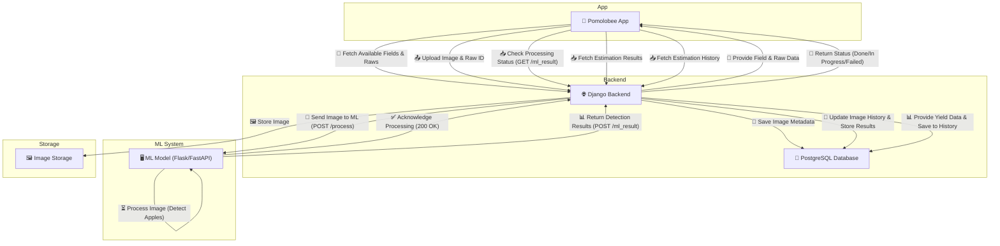

# **Pomolobee Workflow Document**

<details>
<summary>Table of Content</summary>

<!-- TOC -->
- [**Pomolobee Workflow Document**](#pomolobee-workflow-document)
  - [Diagramme](#diagramme)
  - [**Data Flow**](#data-flow)
  - [**1. Workflow Summary**](#1-workflow-summary)
    - [**Case: App Initializes Data**](#case-app-initializes-data)
    - [**Case: App Requests Estimation Based on a Picture**](#case-app-requests-estimation-based-on-a-picture)
    - [**Case: App Displays Data**](#case-app-displays-data)
  - [**1️⃣ API DJANGO -> APP**](#1-api-django---app)
  - [**2️⃣ API DJANGO <-> ML**](#2-api-django---ml)
  - [**3️⃣ Process Image API (Django to ML)**](#3-process-image-api-django-to-ml)
  - [**2. Detailed Requirements**](#2-detailed-requirements)
    - [**App Requirements**](#app-requirements)
    - [**ML Model Requirements**](#ml-model-requirements)
    - [**Django Backend Requirements**](#django-backend-requirements)
  - [**3. Explanation of Calculation**](#3-explanation-of-calculation)
    - [**How Yield is Estimated**](#how-yield-is-estimated)
<!-- TOC END -->
 
</details>


---
## Diagramme
## **Data Flow**



## **1. Workflow Summary**

### **Case: App Initializes Data**

📌 `GET /api/fields/`  
📌 `GET /api/fruits/`  
📌 `GET /api/locations/`  
1. **App starts up or the user refreshes data.**  
2. **App fetches static data** from Django:  
   - `Field`, `Raw`, `Fruit` tables.  
   - This data is stored locally for offline use.  
3. **App syncs periodically** to check for updates in Django.  

---

### **Case: App Requests Estimation Based on a Picture**

#### **Step 1: App Uploads Image**
📌 `POST /api/images/`  
📩 **App sends:** `image`, `raw_id`, `date`  
📩 **Backend returns:** `image_id`  

**Django stores image & schedules ML processing:**  
   - Saves image in the **file system** on the server.  
   - Creates a new entry in `ImageHistory`:  
     - `image_path`: Path to the saved image.  
     - `nb_apfel`: Placeholder (waiting for ML result).  

---

#### **Step 2: ML Processes Image (Async Job)**
📌 **ML model detects `nb_apfel` and updates `ImageHistory`.**  
📌 **ML also returns `confidence_score`.**  
📌 **Django updates `ImageHistory` and creates `HistoryEstimation`.**  

---

#### **Step 3: Retrieve Estimation**
📌 `GET /api/estimations/{image_id}`  
📩 **App requests:** `image_id`  
📩 **Backend returns:**  
```json
{
    "plant_apfel": 12,
    "plant_kg": 2.4,
    "raw_kg": 48.0,
    "confidence_score": 0.85,
    "status": "done"
}
```
📌 **Django creates `HistoryRaw` and `HistoryEstimation`, referencing `ImageHistory`**:  
   - **ML results from `ImageHistory`.**  
   - **Calculated yield per plant (`plant_kg`).**  
   - **Total estimated yield (`raw_kg`).**  
   - **References the saved image (`id_image`).**  

---

### **Case: App Displays Data**
1. **Displays static data (Fields, Raws, Fruits)**  
   - Retrieved from Django and stored locally.  

2. **Displays estimation results**  
   - Fetches the latest `HistoryRaw` entries for the selected `Raw`.  
   - Shows `plant_apfel`, `plant_kg`, `raw_kg`, and other ML estimations.  

---

## **1️⃣ API DJANGO -> APP**
**Endpoints for communication between Django and the App:**  
- `POST /api/images/` → Uploads an image & starts ML processing  
- `GET /api/images/{image_id}/status` → Checks if ML has processed the image  
- `GET /api/estimations/{image_id}` → Retrieves the estimation results  

| `GET /api/fields/` | fetch all fields |
| `GET /api/fields/{field_id}/raws/` |to fetch raws for a given field | 


---

## **2️⃣ API DJANGO <-> ML**
**Endpoints for communication between Django and the ML model:**  
- `POST /process-image/` → Django sends an image to ML for processing  
- ML returns: `nb_apfel` (number of apples detected) and `confidence_score`  

---

## **3️⃣ Process Image API (Django to ML)**
📌 **Step 1: App uploads image** → `POST /api/images/`  
📌 **Step 2: Django sends image to ML API** → `POST /process-image/`  
📌 **Step 3: ML detects apples & returns results**  

✅ **Django View: Sends Image to ML API**
 
---
## **2. Detailed Requirements**

### **App Requirements**
✅ Store static data locally for offline mode.  
✅ Send an image and raw_id to Django for estimation.  
✅ Fetch results (`HistoryRaw`) for past estimations.  
✅ Sync with Django when online.  

### **ML Model Requirements**
✅ Process an image and return `nb_apfel` (number of apples detected).  
✅ Return results quickly to avoid app delays.  
✅ Be integrated with Django, either running inside Django or as an external service.  

### **Django Backend Requirements**
✅ Store the image on the server file system.  
✅ Create `ImageHistory` with image path + ML results.  
✅ Calculate `plant_kg` and `raw_kg` before saving to `HistoryRaw`.  
✅ Provide API endpoints for the app to fetch data. 
✅ Store the image **on the local file system or a cloud storage solution (e.g., AWS S3, Google Cloud Storage)**.  


---

## **3. Explanation of Calculation**

### **How Yield is Estimated**
1. **ML Model detects apples in the image**  
   - Frontend sends `image + raw ID + date` to Django.  
   - Django stores the image path in `ImageHistory`.  
   - ML analyzes the image and returns `nb_apfel` (number of apples detected).  

2. **Django calculates expected yield**  
   - **`plant_apfel = nb_apfel`** (ML-detected apples per plant).  
   - **`plant_kg = plant_apfel * fruit_avg_kg`** (expected weight per plant).  
   - **`raw_kg = plant_kg * raw.nb_plant`** (expected total weight for the raw).  

---
 
--- 