# **PomoloBee Workflow Document**

Table of Content

<!-- TOC -->
- [**PomoloBee Workflow Document**](#pomolobee-workflow-document)
  - [**Data Flow**](#data-flow)
  - [**1. Workflow Summary**](#1-workflow-summary)
    - [**Case App Initializes Data**](#case-app-initializes-data)
    - [**Case App Requests Estimation Based on a Picture**](#case-app-requests-estimation-based-on-a-picture)
    - [**Case App Displays Data**](#case-app-displays-data)
  - [**1. API DJANGO to APP**](#1-api-django-to-app)
    - [Image Upload Result](#image-upload-result)
    - [Estimations](#estimations)
    - [Orchard Data](#orchard-data)
  - [**2. API DJANGO both ML**](#2-api-django-both-ml)
  - [**3. Process Image Flow**](#3-process-image-flow)
  - [**2. Detailed Requirements**](#2-detailed-requirements)
    - [App Requirements](#app-requirements)
    - [ML Model Requirements](#ml-model-requirements)
    - [Django Requirements](#django-requirements)
  - [**3. Explanation of Calculation**](#3-explanation-of-calculation)
  - [API Short List](#api-short-list)
  - [**2. Detailed Requirements**](#2-detailed-requirements)
    - [**App Requirements**](#app-requirements)
    - [**ML Model Requirements**](#ml-model-requirements)
    - [**Django Backend Requirements**](#django-backend-requirements)
  - [**3. Explanation of Calculation**](#3-explanation-of-calculation)
    - [**How Yield is Estimated**](#how-yield-is-estimated)
<!-- TOC END -->

---

## **Data Flow**

```mermaid
graph TD 
  subgraph App
    MobileApp["📱 PomoloBee App"]
  end

  subgraph Backend
    DjangoServer["🌐 Django Backend"]
    Database["📂 PostgreSQL Database"]
  end

  subgraph ML System
    MLService["🖥️ ML Model (Flask/FastAPI)"]
  end

  subgraph Storage
    FileSystem["🖼️ Image Storage"]
  end
 
  MobileApp -- "📍 Fetch Available Fields & Rows" --> DjangoServer
  DjangoServer -- "📄 Provide Field & Row Data" --> MobileApp
 
  MobileApp -- "📤 Upload Image & Row ID" --> DjangoServer
  DjangoServer -- "📂 Save Image Metadata" --> Database
  DjangoServer -- "🖼️ Store Image" --> FileSystem
 
  DjangoServer -- "🔄 POST Image to ML" --> MLService
  MLService -- "✅ 200 OK" --> DjangoServer
  MLService -- "📊 POST Results" --> DjangoServer
  DjangoServer -- "📄 Update Estimation" --> Database

  MobileApp -- "📥 GET Image Metadata & Status" --> DjangoServer
  MobileApp -- "📥 GET Image Estimation" --> DjangoServer
  MobileApp -- "📥 GET Estimation History" --> DjangoServer
```

---

## **1. Workflow Summary**

### **Case App Initializes Data**
- `GET /api/fields/`
- `GET /api/fruits/`
- `GET /api/locations/`

App stores the orchard structure offline.

- `GET /api/ml/version/`
App retrieves ML version (get from ML by Django).

---

### **Case App Requests Estimation Based on a Picture**

#### Step 1 Upload Image
- `POST /api/images/`  
  → Returns `image_id`

#### Step 2 Django Sends to ML
- `POST /process-image/` (internal)

#### Step 3 ML Sends Results
- `POST /api/images/{image_id}/ml_result/`

#### Step 4 App Polls for Metadata Completion
- if processed = true and status = done
- `GET /api/images/{image_id}`  
  → Contains `processed`, `confidence_score`, `nb_fruit`
 
#### Step 5 App Gets Full Estimation
- `GET /api/images/{image_id}/estimations/` 

#### option step if processed failed App can retry processing
- if  status = failed
  - `POST /api/retry_processing/`  

---

### **Case App Displays Data**
- Static data is shown from local DB (synced from API).
- For estimations associated to a field :
  - `GET /api/fields/{field_id}/estimations/`  
  - Displays previous yield predictions and image data if necessary

 

 

---

## **1. API DJANGO to APP**

### Image Upload Result
| Method | Endpoint | Description |
|--------|----------|-------------|
| `POST` | `/api/images/` | Upload new image |
| `GET` | `/api/images/{image_id}` | Get image metadata and status |
| `POST` | `/api/retry_processing/` | retry processing images |
| `DELETE` | `/api/images/{image_id}/` | delete a picture from storage

### Estimations
| Method | Endpoint | Description |
|--------|----------|-------------|
| `GET` | `/api/images/{image_id}/estimations/` | Get estimation for one image ✅ |
| `GET` | `/api/fields/{field_id}/estimations/` | Get all estimations for a field ✅ |

### Orchard Data
| Method | Endpoint | Description |
|--------|----------|-------------|
| `GET` | `/api/fields/` | List all fields |
| `GET` | `/api/fruits/` | List all fruits |
| `GET` | `/api/locations/` | All fields with row rows |

---

## **2. API DJANGO both ML**

| Method | Endpoint | Description |
|--------|----------|-------------|
| `POST` | `/process-image/` | Django sends image to ML |
| `POST` | `/api/images/{image_id}/ml_result/` | ML sends back results ✅ |

---

## **3. Process Image Flow**
1. `POST /api/images/` ← From App  
2. `POST /process-image/` ← Django → ML  
3. `POST /api/images/{image_id}/ml_result/` ← ML → Django  
4. `GET /api/images/{image_id}` ← App polling  
5. `GET /api/images/{image_id}/estimations/` ← App gets results

---

## **2. Detailed Requirements**

### App Requirements
- Store image locally
- Upload image and row_id
- Poll and fetch estimation

### ML Model Requirements
- Accept image + ID
- Return `nb_fruit`, `confidence_score`

### Django Requirements
- Store and track image
- Compute `plant_kg` and `row_kg`
- Serve estimation & orchard data

---

## **3. Explanation of Calculation**

- `plant_fruit = nb_fruit`
- `plant_kg = plant_fruit * fruit_avg_kg`
- `row_kg = plant_kg * row.nb_plant`

---

## API Short List

| Type | Endpoint | Purpose |
|------|----------|---------|
| `GET` | `/api/fields/` | All fields |
| `GET` | `/api/fruits/` | All fruits |
| `GET` | `/api/locations/` | Fields + rows |
| `GET` | `/api/fields/{field_id}/estimations/` | Estimations for a field ✅ |
| `GET` | `/api/images/{image_id}/details` | Image metadata/status ✅ |
| `DELETE` | `/api/images/{image_id}` | Delete Image from storage |
| `POST` | `/api/images/` | Upload new image |
| `POST` | `/api/retry_processing/` | Retry ML |
| `GET` | `/api/images/{image_id}/estimations/` | Estimation from one image ✅ |
| `POST` | `/api/images/{image_id}/ml_result/` | ML sends results ✅ |
| `GET` | `/api/ml/version/` | Get ML version |

---

Let me know if you want this in **Markdown**, **OpenAPI**, or **Postman Collection** format as next step 🔧
---
## **2. Detailed Requirements**

### **App Requirements**
✅ Store static data locally for offline mode.  
✅ Send an image and row_id to Django for estimation.  

✅ Fetch results for past estimations.  
✅ Sync with Django when online.  

### **ML Model Requirements**
✅ Process an image and return `nb_fruit` (number of fruit detected).  
✅ Return results quickly to avoid app delays.  
✅ Be integrated with Django, either running inside Django or as an external service.  

### **Django Backend Requirements**
✅ Store the image on the server file system.  
✅ Create `Image` with image path + ML results.  
✅ Calculate `plant_kg` and `row_kg` before saving to `Estimation`.  
✅ Provide API endpoints for the app to fetch data. 
✅ Store the image **on the local file system or a cloud storage solution (e.g., AWS S3, Google Cloud Storage)**.  

---

## **3. Explanation of Calculation**

### **How Yield is Estimated**
1. **ML Model detects fruit in the image**  
   - Frontend sends `image + row ID + date` to Django.  
   - Django stores the image path in `Image`.  
   - ML analyzes the image and returns `nb_fruit` (number of fruit detected).  

2. **Django calculates expected yield**  
   - **`plant_fruit = nb_fruit`** (ML-detected fruit per plant).  
   - **`plant_kg = plant_fruit * fruit_avg_kg`** (expected weight per plant).  
   - **`row_kg = plant_kg * row.nb_plant`** (expected total weight for the row).  

---
 
--- 