# **📜 Pomolobee Workflow Document**  

## **Table of Contents**  
1. **Workflow Summary**  
   - Case: App initializes data  
   - Case: App requests estimation based on a picture  
   - Case: App displays data  
2. **Detailed Requirements**  
   - In the App  
   - In the ML Model  
   - In Django Backend  
3. **Explanation of Calculation**  
4. **API Design**  
   - API Call Order  
   - Polling Strategy  

---
## Diagramme
## **🌍 Data Flow**

```mermaid
graph TD
  subgraph App
    MobileApp["📱 Pomolobee App"]
  end

  subgraph Backend
    DjangoServer["🌐 Django Backend"]
    Database["📂 PostgreSQL Database"]
  end

  subgraph ML System
    MLService["🖥️ ML Model (Flask/FastAPI)"]
  end

  subgraph Storage
    FileSystem["🖼️ Image Storage"]
  end

  MobileApp -- "📤 Upload Image & Raw ID" --> DjangoServer
  DjangoServer -- "📂 Save Image" --> FileSystem
  DjangoServer -- "🔄 Send Image to ML" --> MLService
  MLService -- "🔢 Detect Apples & Confidence Score" --> DjangoServer
  DjangoServer -- "📄 Update Image History & Store Results" --> Database
  MobileApp -- "📥 Check Processing Status" --> DjangoServer
  DjangoServer -- "📄 Return Status (Done/In Progress)" --> MobileApp
  MobileApp -- "📥 Fetch Estimation Results" --> DjangoServer
  DjangoServer -- "📄 Provide Yield Data" --> MobileApp
```


## **1. Workflow Summary**  

### **📌 Case: App Initializes Data**  
1. **App starts up or the user refreshes data.**  
2. **App fetches static data** from Django:  
   - `Field`, `Raw`, `Fruit` tables.  
   - This data is stored locally for offline use.  
3. **App syncs periodically** to check for updates in Django.  

---

### **📌 Case: App Requests Estimation Based on a Picture**  

#### **Step 1: App Uploads Image**  
📌 `POST /api/images/`  
📩 **App sends:** `image`, `raw_id`, `date`  
📩 **Backend returns:** `image_id`  

**Django stores image & schedules ML processing:**  
   - Saves image in the **file system** on the server.  
   - Creates a new entry in `ImageHistory`:  
     - `image_path`: Path to the saved image.  
     - `nb_apfel`: Placeholder (waiting for ML result).  

---

#### **Step 2: ML Processes Image (Async Job)**  
📌 **ML model detects `nb_apfel` and updates `ImageHistory`.**  
📌 **ML also returns `confidence_score`.**  
📌 **Django updates `ImageHistory` and creates `HistoryEstimation`.**  

---

#### **Step 3: Retrieve Estimation**  
📌 `GET /api/estimations/{image_id}`  
📩 **App requests:** `image_id`  
📩 **Backend returns:**  
```json
{
    "plant_apfel": 12,
    "plant_kg": 2.4,
    "raw_kg": 48.0,
    "confidence_score": 0.85,
    "status": "done"
}
```
📌 **Django creates `HistoryRaw` and `HistoryEstimation`, referencing `ImageHistory`**:  
   - **ML results from `ImageHistory`.**  
   - **Calculated yield per plant (`plant_kg`).**  
   - **Total estimated yield (`raw_kg`).**  
   - **References the saved image (`id_image`).**  

---

### **📌 Case: App Displays Data**  
1. **Displays static data (Fields, Raws, Fruits)**  
   - Retrieved from Django and stored locally.  

2. **Displays estimation results**  
   - Fetches the latest `HistoryRaw` entries for the selected `Raw`.  
   - Shows `plant_apfel`, `plant_kg`, `raw_kg`, and other ML estimations.  

---

## **2. Detailed Requirements**  

### **App Requirements**  
✅ Store static data locally for offline mode.  
✅ Send an image and raw_id to Django for estimation.  
✅ Fetch results (`HistoryRaw`) for past estimations.  
✅ Sync with Django when online.  

### **ML Model Requirements**  
✅ Process an image and return `nb_apfel` (number of apples detected).  
✅ Return results quickly to avoid app delays.  
✅ Be integrated with Django, either running inside Django or as an external service.  

### **Django Backend Requirements**  
✅ Store the image on the server file system.  
✅ Create `ImageHistory` with image path + ML results.  
✅ Calculate `plant_kg` and `raw_kg` before saving to `HistoryRaw`.  
✅ Provide API endpoints for the app to fetch data. 
✅ Store the image **on the local file system or a cloud storage solution (e.g., AWS S3, Google Cloud Storage)**.  


---

## **3. Explanation of Calculation**  

### **📌 How Yield is Estimated**  
1. **ML Model detects apples in the image**  
   - Frontend sends `image + raw ID + date` to Django.  
   - Django stores the image path in `ImageHistory`.  
   - ML analyzes the image and returns `nb_apfel` (number of apples detected).  

2. **Django calculates expected yield**  
   - **`plant_apfel = nb_apfel`** (ML-detected apples per plant).  
   - **`plant_kg = plant_apfel * fruit_avg_kg`** (expected weight per plant).  
   - **`raw_kg = plant_kg * raw.nb_plant`** (expected total weight for the raw).  

---

## **4. API Design**  

### **API Call Order**  
📌 `POST /api/images/` (Upload Image)  
📌 `GET /api/images/{image_id}/status` (Check Processing Status)  
📌 `GET /api/estimations/{image_id}` (Fetch Estimation Results)  

---

### **Polling Strategy**  
📌 The app checks `GET /api/images/{image_id}/status` every **minute**.  
📌 If `status = "done"`, the app fetches results.  
📌 If the process takes longer than **5 retries (5 minutes)**, the app should **show a warning**.  
📌 If ML takes longer than 5 minutes, Django should **log the delay** and optionally **send a retry request to ML**.  


🔹 **Why?**  
- Prevents infinite polling loops.  
- Ensures the user is **not left waiting indefinitely**.  

---

## **Error Handling Strategy**  
📌 **What if ML processing fails?**  
- If ML **returns an error**, Django should mark `processed = false` in `ImageHistory`.  
- The app should **stop polling after 5 attempts** and **display an error message**.

📌 **What if the app sends an invalid image?**  
- Django should return `400 Bad Request` if the image format is incorrect.  
- The app should prompt the user to upload a valid image.


--- 